Exploratory Data Analysis
================
Stella Koo (bk2959), Yanhao Shen
2024-11-16

## Data Cleaning & Preparing for Analysis

``` r
library(tidyverse)
library(lsr)
library(vcd)

cleveland = read_csv("./data/cleveland.csv", na = "?")
hungary = read_csv("./data/hungarian.csv", na = "?")
long_beach = read_csv("./data/long_beach_va.csv", na = "?")
switzerland = read_csv("./data/switzerland.csv", na = "?")
```

``` r
dfs = list(cleveland, hungary, long_beach, switzerland)
regions = c("Cleveland", "Hungary", "Long Beach", "Switzerland")

combined_df = map2(dfs, regions, ~ mutate(.x, region = .y)) |>
  bind_rows()
```

## Summary of variables

The tables below displays descriptive statistics for each variable in
the heart disease dataset, organized by region. The continuous variables
include `age`, `trestbps`, `thalach`, `oldpeak` while the discrete
variables consist of `sex`, `cp`, `fbs`, `restecg`, `exang`. These
variables will be used to assess the diagnosis of heart disease, as
indicated by the `num` variable.

Variables `ca` and `thal` were excluded from the analysis due to
incomplete data, with missing values exceeding 85% in more than two
regions, rendering these variables non-comparable. Additionally, the
`chol` variable was removed from the analysis as all observations in
Switzerland had a value of 0

### Cleveland

``` r
summary = function(dataset) {
  dataset_summary = skimr::skim(dataset) |> 
    as.data.frame() |>  
    select(2:6)

  knitr::kable(dataset_summary, digits = 2)
}

summary(cleveland)
```

| skim_variable | n_missing | complete_rate | numeric.mean | numeric.sd |
|:--------------|----------:|--------------:|-------------:|-----------:|
| age           |         0 |          1.00 |        54.44 |       9.04 |
| sex           |         0 |          1.00 |         0.68 |       0.47 |
| cp            |         0 |          1.00 |         3.16 |       0.96 |
| trestbps      |         0 |          1.00 |       131.69 |      17.60 |
| chol          |         0 |          1.00 |       246.69 |      51.78 |
| fbs           |         0 |          1.00 |         0.15 |       0.36 |
| restecg       |         0 |          1.00 |         0.99 |       0.99 |
| thalach       |         0 |          1.00 |       149.61 |      22.88 |
| exang         |         0 |          1.00 |         0.33 |       0.47 |
| oldpeak       |         0 |          1.00 |         1.04 |       1.16 |
| slope         |         0 |          1.00 |         1.60 |       0.62 |
| ca            |         4 |          0.99 |         0.67 |       0.94 |
| thal          |         2 |          0.99 |         4.73 |       1.94 |
| num           |         0 |          1.00 |         0.94 |       1.23 |

### Hungary

``` r
summary(hungary)
```

| skim_variable | n_missing | complete_rate | numeric.mean | numeric.sd |
|:--------------|----------:|--------------:|-------------:|-----------:|
| age           |         0 |          1.00 |        47.83 |       7.81 |
| sex           |         0 |          1.00 |         0.72 |       0.45 |
| cp            |         0 |          1.00 |         2.98 |       0.97 |
| trestbps      |         1 |          1.00 |       132.58 |      17.63 |
| chol          |        23 |          0.92 |       250.85 |      67.66 |
| fbs           |         8 |          0.97 |         0.07 |       0.26 |
| restecg       |         1 |          1.00 |         0.22 |       0.46 |
| thalach       |         1 |          1.00 |       139.13 |      23.59 |
| exang         |         1 |          1.00 |         0.30 |       0.46 |
| oldpeak       |         0 |          1.00 |         0.59 |       0.91 |
| slope         |       190 |          0.35 |         1.89 |       0.34 |
| ca            |       291 |          0.01 |         0.00 |       0.00 |
| thal          |       266 |          0.10 |         5.64 |       1.62 |
| num           |         0 |          1.00 |         0.36 |       0.48 |

### Long Beach

``` r
summary(long_beach)
```

| skim_variable | n_missing | complete_rate | numeric.mean | numeric.sd |
|:--------------|----------:|--------------:|-------------:|-----------:|
| age           |         0 |          1.00 |        59.35 |       7.81 |
| sex           |         0 |          1.00 |         0.97 |       0.17 |
| cp            |         0 |          1.00 |         3.50 |       0.80 |
| trestbps      |        56 |          0.72 |       133.76 |      21.54 |
| chol          |         7 |          0.96 |       178.75 |     114.04 |
| fbs           |         7 |          0.96 |         0.35 |       0.48 |
| restecg       |         0 |          1.00 |         0.74 |       0.68 |
| thalach       |        53 |          0.74 |       122.80 |      21.99 |
| exang         |        53 |          0.74 |         0.65 |       0.48 |
| oldpeak       |        56 |          0.72 |         1.32 |       1.11 |
| slope         |       102 |          0.49 |         2.13 |       0.67 |
| ca            |       198 |          0.01 |         0.00 |       0.00 |
| thal          |       166 |          0.17 |         6.29 |       1.29 |
| num           |         0 |          1.00 |         1.52 |       1.22 |

### Switzerland

``` r
summary(switzerland)
```

| skim_variable | n_missing | complete_rate | numeric.mean | numeric.sd |
|:--------------|----------:|--------------:|-------------:|-----------:|
| age           |         0 |          1.00 |        55.32 |       9.03 |
| sex           |         0 |          1.00 |         0.92 |       0.27 |
| cp            |         0 |          1.00 |         3.70 |       0.69 |
| trestbps      |         2 |          0.98 |       130.21 |      22.56 |
| chol          |         0 |          1.00 |         0.00 |       0.00 |
| fbs           |        75 |          0.39 |         0.10 |       0.31 |
| restecg       |         1 |          0.99 |         0.36 |       0.59 |
| thalach       |         1 |          0.99 |       121.56 |      25.98 |
| exang         |         1 |          0.99 |         0.44 |       0.50 |
| oldpeak       |         6 |          0.95 |         0.65 |       1.06 |
| slope         |        17 |          0.86 |         1.80 |       0.62 |
| ca            |       118 |          0.04 |         1.60 |       0.55 |
| thal          |        52 |          0.58 |         5.79 |       1.73 |
| num           |         0 |          1.00 |         1.80 |       1.01 |

## Distribution of participants

The plot illustrates the distribution of participants by age and sex
across different regions, with respect to the diagnosis of heart
disease. It is evident that the distribution varies significantly by
region, likely due to differences in participant availability for the
study across these regions.

Overall, there are noticeably more male participants, and the age
distribution is relatively sparse for both groups—those without heart
disease and those with heart disease. However, distinct patterns emerge
when considering the regional breakdown. To gain a deeper understanding
of the factors influencing heart disease prevalence, a more detailed
analysis is necessary to identify which variables are contributing to
the observed trends, and how these factors may differ or remain
consistent across regions.

``` r
ggplot(combined_df, aes(x = age, y = num, color = factor(sex, levels = c(0,1), labels = c("Female", "Male")))) +
  geom_point(alpha = 0.7) +
  facet_wrap(~ region) +
  theme_minimal() +
  labs(title = "Distribution of participants",
       x = "Age",
       y = "Heart Disease Status",
       color = "Sex")
```

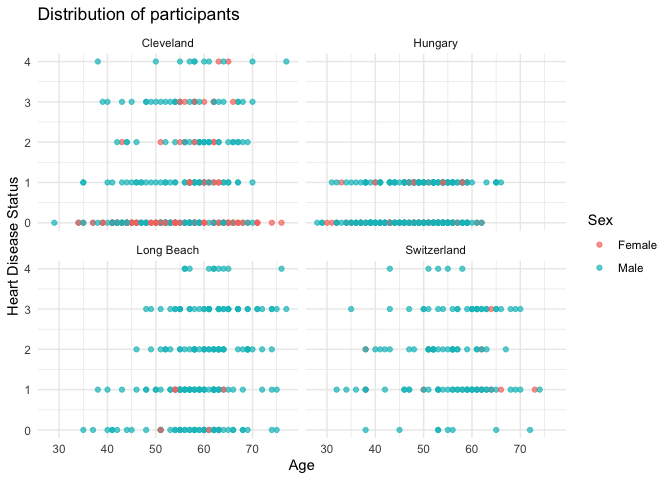<!-- -->

In Hungary, the heart disease status (`num`) is limited to values 0 or
1, with no data available for statuses 2, 3, and 4, which also indicate
the presence of heart disease. To ensure consistency across regions, the
`num` variable was reclassified into a binary format, with 0
representing no heart disease and 1 representing heart disease.

``` r
combined_df = combined_df |>
  mutate(num = factor(ifelse(num == 0, 0, 1), levels = c(0, 1)),
  sex = factor(sex, levels = c(0, 1)),
  slope = factor(slope),
  thal = factor(thal),
  cp = factor(cp),
  fbs = factor(fbs),
  restecg = factor(restecg),
  exang = factor(exang))
```

## Continuous Variables

### Correlation heatmap for each region

A correlation heatmap was generated for each region to examine the
relationships between the variables, assess whether these correlations
vary across regions, and to anayze any potential multicolinearity.

At a glance, the correlations differ across regions, with some showing
stronger relationships than others. The following variables were
selected based on the highest correlation values observed in each
region:

- `age` and `thalach`: A stronger negative correlation was found in
  Hungary (-0.45) and Cleveland (-0.39) compared to Switzerland (-0.29)
  and Long Beach (-0.16).
- `age` and `trestbps`: Long Beach exhibited a stronger positive
  correlation (0.38) than Cleveland (0.28), Hungary (0.26), and
  Switzerland (0.24).
- `thalach` and `trestbps`: A stronger negative relationship was
  observed in Switzerland (-0.23) and Hungary (-0.22) compared to
  Cleveland (-0.05) and Long Beach (0.00).
- `thalach` and `oldpeak`: A stronger negative correlation was seen in
  Cleveland (-0.34) and Hungary (-0.32), while Long Beach (0.19) and
  Switzerland (0.17) displayed weak positive correlations.

Despite these notable correlations, none exceed 0.7, suggesting that
each variable has a unique impact on the outcome (heart disease status).
Therefore, multicollinearity is not a concern when modeling a
regression.

``` r
cols_to_include = c("age", "trestbps", "thalach", "oldpeak")

corr_plots = list()

par(mar = c(1, 1, 2.2, 1))

for(r in regions) {
  region_data = combined_df |> filter(region == r)
  
  corr_matrix = cor(region_data[, cols_to_include], use = "complete.obs")
  
  corr_plots[[r]] = corrplot::corrplot(corr_matrix, 
                                       method = "color", 
                                       type = "lower",
                                       addCoef.col = "black", 
                                       tl.col = "black",
                                       tl.srt = 45)
  mtext(paste("Correlation Heatmap for", r), side = 3, line = 1, cex = 1.5)

}
```

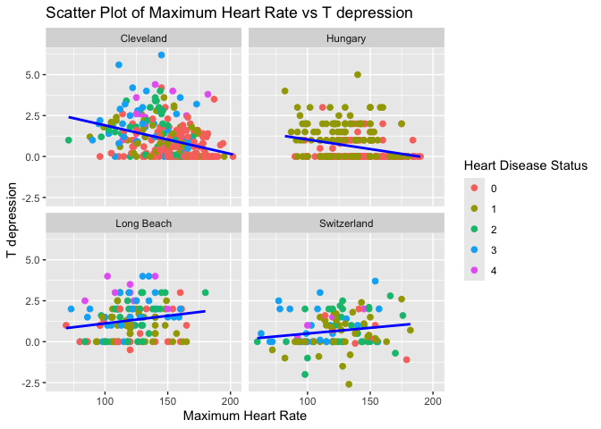<!-- -->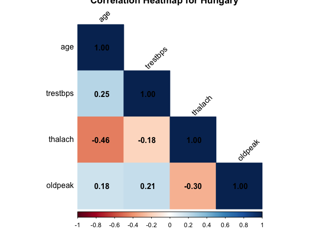<!-- -->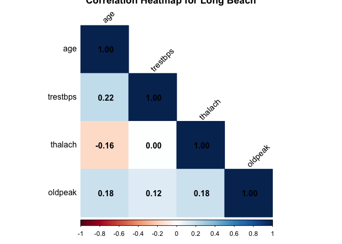<!-- -->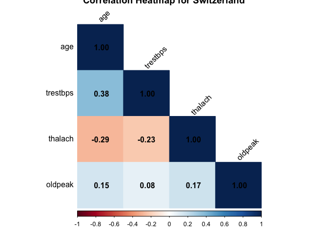<!-- -->

#### Relationship Between Variables and Heart Disease Status

Boxplots were generated for each continuous variable in relation to
heart disease status (`num`) across different regions. This analysis
aimed to visually explore potential relationships between these
variables and the binary outcome of heart disease status, while also
highlighting regional differences in the distributions of continuous
variables.

##### Age (`age`)

Age is generally higher in heart disease cases across all regions, but
the degree of overlap varies. Cleveland and Hungary show more distinct
separation, with heart disease cases skewed toward older individuals.
Long Beach and Switzerland exhibit greater overlap, suggesting weaker
age-based differentiation. Outliers in younger individuals with heart
disease are present in Switzerland and Long Beach.

Age is a strong predictor, especially in Cleveland and Hungary, where
separation is more pronounced. Regions with greater overlap (Long Beach,
Switzerland) suggest the need for interaction terms.

``` r
box_plot = function(data, variable) {
  plot = ggplot(data, aes(x = factor(num), y = .data[[variable]], fill = factor(num))) +
      geom_boxplot() +
      theme(legend.position = "none") +
      facet_wrap(~region) 
  
  return(plot) 
}

plot_age = box_plot(combined_df, "age")

plot_age + 
  labs(title = "Boxplot of Age by Heart Disease Status",
       x = "heart disease status",
       y = "age")
```

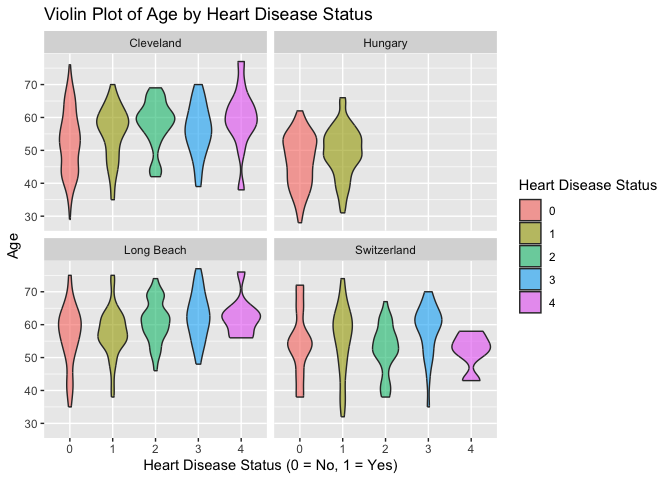<!-- -->

##### Resting Blood Pressure (in mm Hg, `trestbps`)

Resting blood pressure shows minimal separation between heart disease
and non-heart disease groups in most regions. Medians and interquartile
ranges are similar across heart disease statuses in Cleveland, Hungary,
and Long Beach. Switzerland shows slightly better separation, though the
overlap remains significant. Outliers are observed in Cleveland and Long
Beach, particularly for non-heart disease cases.

Resting blood pressure may have limited predictive value, as the overlap
between the groups is significant across all regions. However, it could
still contribute as a secondary predictor or in interaction with other
variables.

``` r
plot_trestbps = box_plot(combined_df, "trestbps")

plot_trestbps + 
  labs(title = "Boxplot of Resting Blood Pressure by Heart Disease Status",
       x = "heart disease status",
       y = "resting blood pressure (in mm Hg)")
```

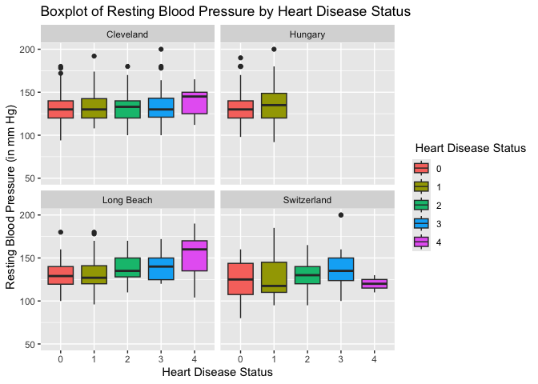<!-- -->

##### Maximum Heart Rate (`thalach`)

Across all regions, individuals with heart disease generally have lower
maximum heart rates, though the degree of separation varies. Cleveland
and Hungary show larger differences between the two groups. Long Beach
and Switzerland show more overlap, particularly in the upper ranges of
heart rates. Cleveland also has more outliers among non-heart disease
cases.

Maximum heart rate is a strong predictor of heart disease across most
regions, given its consistent trend of lower values in heart disease
cases.

``` r
plot_thalach = box_plot(combined_df, "thalach")

plot_thalach + 
  labs(title = "Boxplot of Maximum Heart Rate by Heart Disease Status",
       x = "heart disease status",
       y = "maximum heart rate")
```

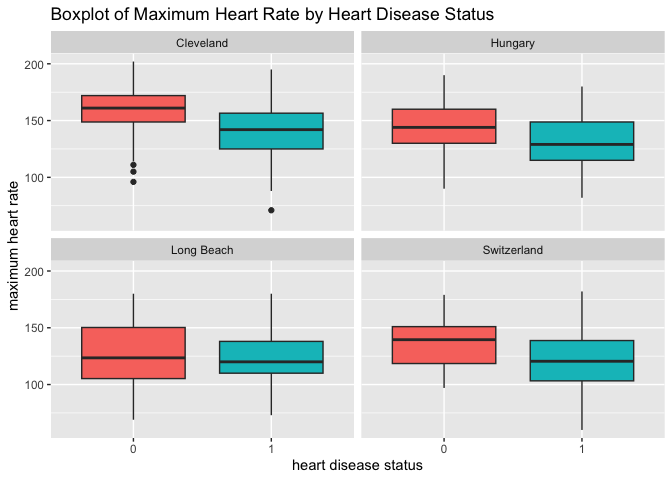<!-- -->

##### T Depression (`oldpeak`)

T depression appears higher in individuals with heart disease (status
= 1) across all locations compared to those without (status = 0).
Cleveland and Hungary show higher median T depression and larger
interquartile ranges for heart disease cases compared to non-cases. Long
Beach and Switzerland show smaller differences between heart disease and
non-heart disease groups, with generally lower T depression levels.
Outliers in Cleveland and Hungary are more pronounced, suggesting
regional-specific variability.

T depression is likely a good predictor, particularly for Cleveland and
Hungary, as it shows a clear separation between heart disease and
non-heart disease cases. However, its predictive power may vary across
regions, necessitating region-specific adjustments.

``` r
plot_oldpeak = box_plot(combined_df, "oldpeak")

plot_oldpeak + 
  labs(title = "Boxplot of T Depression by Heart Disease Status",
       x = "heart disease status",
       y = "T depression")
```

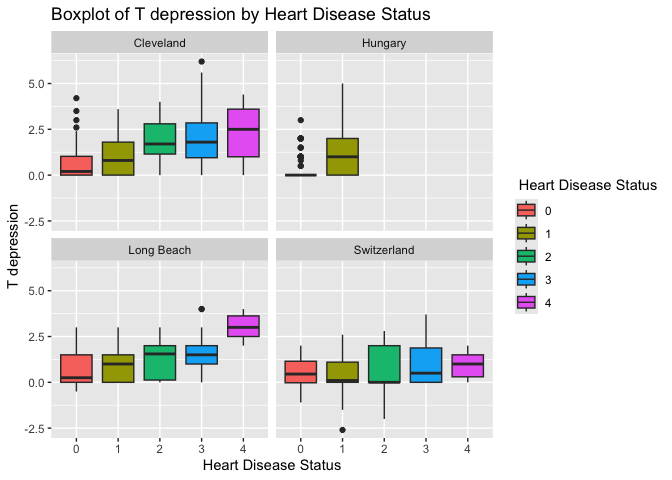<!-- -->

## Catagorical Variables

the datasets have 7 catagorical Variables:  
sex: 1=male; 0=female  
cp (chest pain type): 1=typical angina; 2=atypical angina; 3=non-anginal
pain; 4=asymptomatic  
fbs (fasting blood sugar \> 120 mg/dl): 1=true; 0=false  
restecg (resting electrocardiographic results): 0=normal; 1=having ST-T
wave abnormality (T wave inversions and/or ST elevation or depression of
\> 0.05 mV); 2: showing probable or definite left ventricular
hypertrophy by Estes’ criteria  
exang (exercise induced angina): 1=yes; 0=no  
slope (the slope of the peak exercise ST segment): 1=upsloping; 2=flat;
3=downsloping  
thal: 3=normal; 6=fixed defect; 7=reversable defect  
To examine the variables’ association with num, I will be using Cramér’s
V, which is a method based on the Chi-Squared statistic from a
contingency table of the two variables. It quantifies the strength of
the association, providing a value between 0, indicating no association
between the variables and 1, indicating a perfect association. Using
this menthod, we hope to identify key predictors that have strong
association with num, and thus focus on variables with higher Cramér’s V
values in the modeling efforts. This is also a good way in visualization
into the relationships within the data.

now, let’s look in to the plot, we can see that thal and cp have the
highest Cramér’s V (\>=0.5 and \<1), suggesting that they are the most
informative categorical predictors of heart disease in the dataset.
Then, exang, slope, and sex also perform moderately good (\>= 0.3 and
\<0.5), saying that they contribute meaningful information and should be
included in predictive models. lastly, we observe fbs and restecg has
low Cramér’s V (\>0 and \<0.2), indicating that they contribute limited
information to the model.

While for our EDA, we can check each variables to see if they are
complications of heart disease.

``` r
variables <- c("sex", "cp", "fbs", "restecg", "exang", "slope", "thal")

results <- numeric(length(variables))

for (i in seq_along(variables)) {
  var <- variables[i]
  
  df_temp <- combined_df %>%
    select(num, all_of(var)) %>%
    na.omit()
  
  x <- droplevels(as.factor(df_temp$num))
  y <- droplevels(as.factor(df_temp[[var]]))

  table_var <- table(x, y)
  
  results[i] <- cramersV(table_var)
}

association_df <- data.frame(Variable = variables, CramersV = results)

ggplot(association_df, aes(x = reorder(Variable, CramersV), y = CramersV, fill = CramersV)) +
  geom_bar(stat = "identity") +
  coord_flip() +
  scale_fill_gradient(low = "lightblue", high = "darkblue") +
  labs(
    title = "Association Between Heart Disease Status and Predictor Variables",
    x = "Predictor Variables",
    y = "Cramér's V",
    fill = "Cramér's V"
  ) +
  theme_minimal()
```

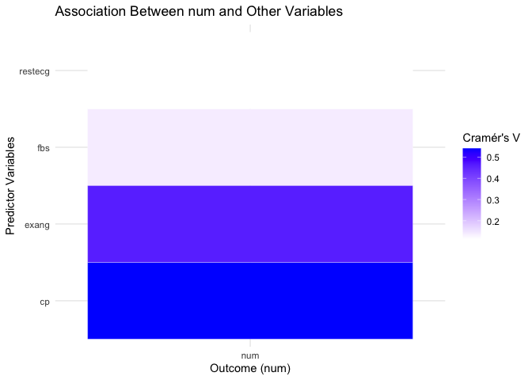<!-- -->

This part of graph is a macro-view of the participants, and in general
terms, man would have less chance of getting heart disease than women.

``` r
ggplot(combined_df, aes(x = sex, fill = num)) +
  geom_bar(position = "fill") +
  facet_wrap(~ region) +
  labs(
    title = "Proportion of Heart Disease Status by sex",
    x = "sex",
    y = "Proportion",
    fill = "Heart Disease Status"
  ) +
  theme_minimal()
```

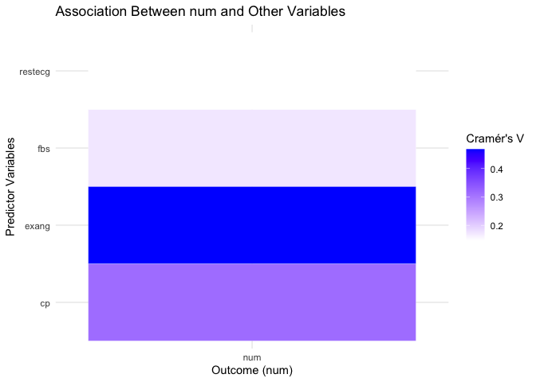<!-- -->

Chest pain type 4 (asymptomatic) has the strongest association with
getting heart disease across all locations. Chest pain type 1, 2, and 3
tend to show fewer cases of heart disease, specifically, for chest pain
2 (atypical angina), it has lowest proportions of individuals with heart
disease, indicating it might not be a complication of heart disease.  
There is consistency across locations, but proportions vary slightly by
region, suggesting potential regional differences in the dataset or
population characteristics.

``` r
ggplot(combined_df, aes(x = cp, fill = num)) +
  geom_bar(position = "fill") +
  facet_wrap(~ region) +
  labs(
    title = "Proportion of Heart Disease Status by Chest Pain Type (cp)",
    x = "Chest Pain Type (cp)",
    y = "Proportion",
    fill = "Heart Disease Status"
  ) +
  theme_minimal()
```

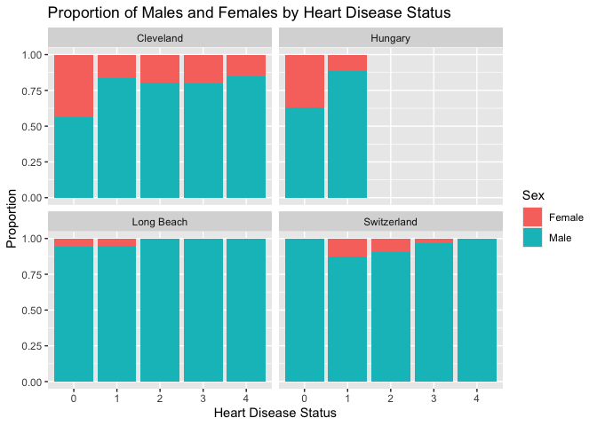<!-- -->

To interpret the graph, we need to know what is “slope”. In an exercise
electrocardiogram(ECG), an “upward slope” on the ST segment generally
indicates a normal response to exercise as the heart works harder and
electrical activity slightly shifts upward. while a “downward slope” on
the ST segment is typically considered abnormal and suggestive of
myocardial ischemia (reduced blood flow to the heart muscle). As result,
we can convert 1(upsloping) as low risk of getting heart disease,
2(flat) and 3(downsloping) as moderate risk and high risk of getting the
disease respectively.  
The results presented in the graph are almost identical to our
interpretation of the variables after conversion. people are less likely
to get the disease when they have normal peak exercise ST Segment, while
for those who observe abnormal peak exercise ST Segmet, they may have a
higher risk of getting heart disease.

``` r
# Plot for 'slope' (Slope of Peak Exercise ST Segment)
ggplot(combined_df |> filter(!is.na(slope)), aes(x = slope, fill = num)) +
  geom_bar(position = "fill") +
  facet_wrap(~ region) +
  labs(
    title = "Proportion of Heart Disease Status by Slope of Peak Exercise ST Segment (slope)",
    x = "Slope of Peak Exercise ST Segment (slope)",
    y = "Proportion",
    fill = "Heart Disease Status"
  ) +
  theme_minimal()
```

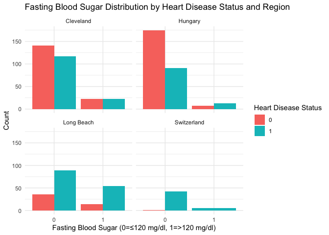<!-- --> For this graph,
we can hardly make any conclusion, because whether the resting
electrocardiographic results are normal or not, There was no significant
reduction in the risk of developing the disease.

``` r
ggplot(combined_df |> filter(!is.na(restecg)), aes(x = restecg, fill = num)) +
  geom_bar(position = "fill") +
  facet_wrap(~ region) +
  labs(
    title = "Proportion of Heart Disease Status by resting electrocardiographic results (restecg)",
    x = "resting electrocardiographic results (restecg)",
    y = "Proportion",
    fill = "Heart Disease Status"
  ) +
  theme_minimal()
```

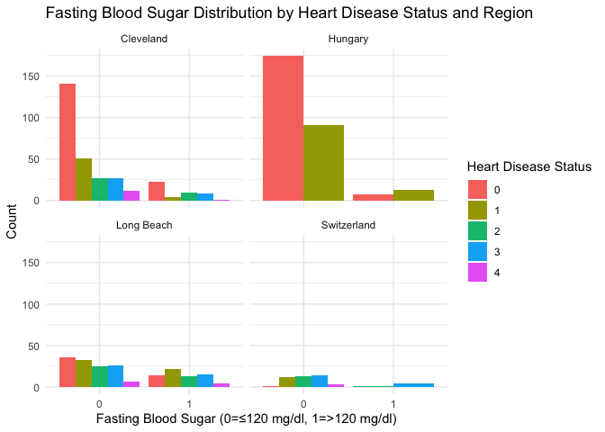<!-- -->

For the graphs list below, we can treat the variables as binary:  
For those who have defect of thalassemia (6 and 7), they tend to have
the disease. If people experienced exercise-induced angina (1), they are
at high risk of getting heart disease. People who have fasting blood
sugar \> 120 mg/dl, they have more chance to get the disease compared to
those \< 120 mg/dl.

``` r
ggplot(combined_df |> filter(!is.na(thal)), aes(x = thal, fill = num)) +
  geom_bar(position = "fill") +
  facet_wrap(~ region) +
  labs(
    title = "Proportion of Heart Disease Status by Thalassemia (thal)",
    x = "Thalassemia (thal)",
    y = "Proportion",
    fill = "Heart Disease Status"
  ) +
  theme_minimal()
```

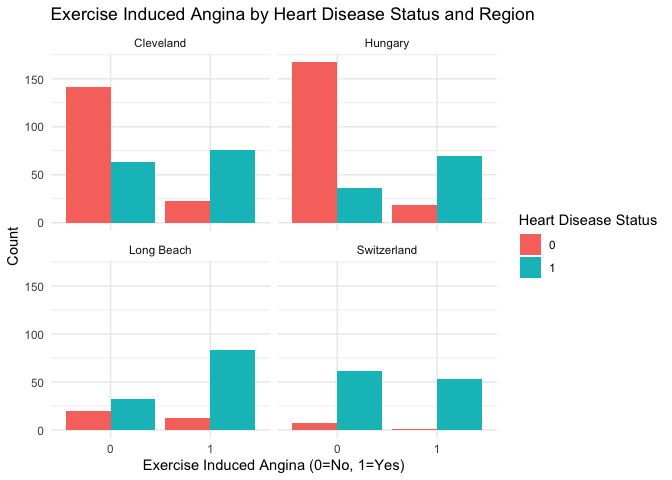<!-- -->

``` r
# Plot for 'exang' (Exercise-Induced Angina)
ggplot(combined_df |> filter(!is.na(exang)), aes(x = exang, fill = num)) +
  geom_bar(position = "fill") +
  facet_wrap(~ region) +
  labs(
    title = "Proportion of Heart Disease Status by Exercise-Induced Angina (exang)",
    x = "Exercise-Induced Angina (exang)",
    y = "Proportion",
    fill = "Heart Disease Status"
  ) +
  theme_minimal()
```

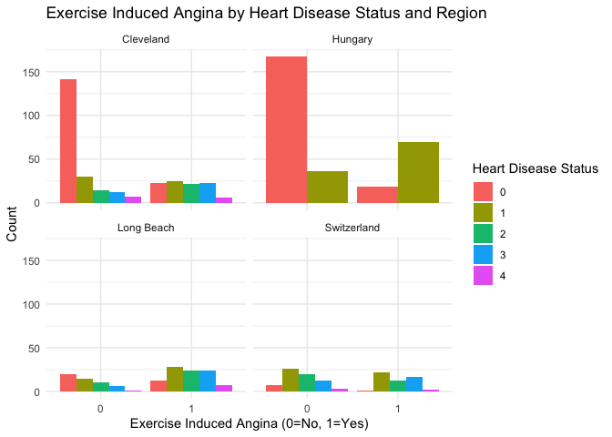<!-- -->

``` r
ggplot(combined_df |> filter(!is.na(fbs)), aes(x = fbs, fill = num)) +
  geom_bar(position = "fill") +
  facet_wrap(~ region) +
  labs(
    title = "Proportion of Heart Disease Status by fasting blood sugar > 120 mg/dl (fbs)",
    x = "fasting blood sugar > 120 mg/dl (fbs)",
    y = "Proportion",
    fill = "Heart Disease Status"
  ) +
  theme_minimal()
```

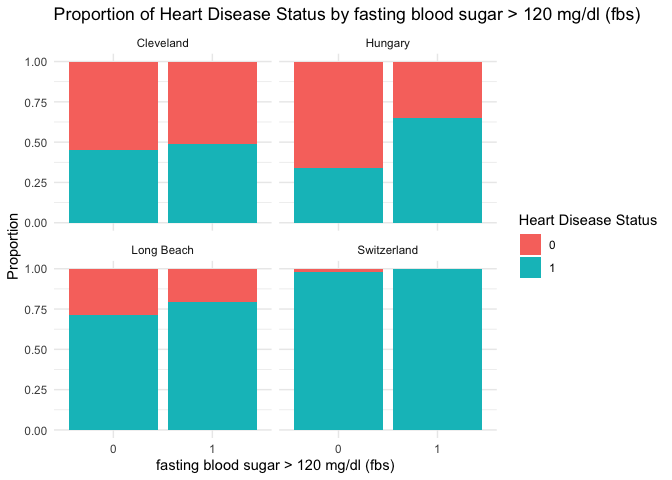<!-- -->

Though some variables may not suitable for the model, we can still
conclude that the complications of hart disease may be include
asymptomatic chest pain, abnormal Peak Exercise ST Segment, defect of
thalassemia, exercise-induced angina, and fasting blood sugar \> 120
mg/dl.  
