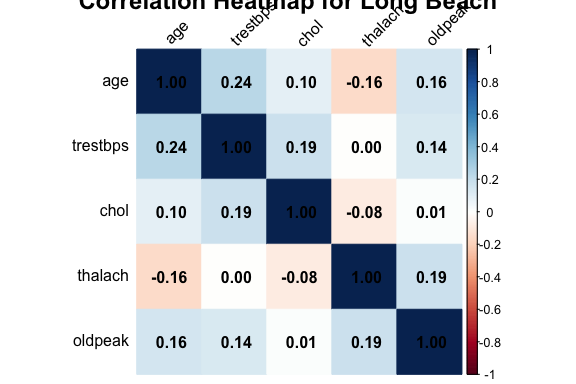
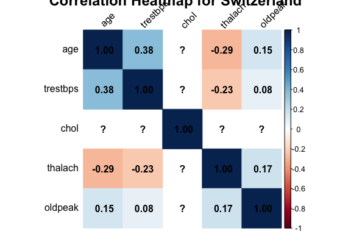

EDA
================
Stella Koo
2024-11-16

# Issues to discuss

- For Summary of varaibles, should categorical data be included?

- Cannot create a proper reader friendly table

- Have trouble resizing correlation heatmap

- Cholesterol variable all zero for Switzerland dataset

- Analysis by sex could be misleading since some locations might have
  not selected many female participants?

- Need to decide which graphs to include/remove

## Data Cleaning & Preparing for Analysis

``` r
library(tidyverse)
library(pheatmap)
library(corrplot)
library(knitr)

cleveland = read_csv("./data/cleveland.csv", na = "?")
hungary = read_csv("./data/hungarian.csv", na = "?")
long_beach = read_csv("./data/long_beach_va.csv", na = "?")
switzerland = read_csv("./data/switzerland.csv", na = "?")
```

``` r
dfs = list(cleveland, hungary, long_beach, switzerland)
regions = c("Cleveland", "Hungary", "Long Beach", "Switzerland")

combined_df = map2(dfs, regions, ~ mutate(.x, region = .y)) |>
  bind_rows()
```

## Summary of variables

``` r
summary_df = function(dataset) {
  map(dataset, ~skimr::skim(.x) |>
        select(2:6) |>
        knitr::kable(digits = 2))
}

summary_df(dfs)
```

    ## [[1]]
    ## 
    ## 
    ## |skim_variable | n_missing| complete_rate| numeric.mean| numeric.sd|
    ## |:-------------|---------:|-------------:|------------:|----------:|
    ## |age           |         0|          1.00|        54.44|       9.04|
    ## |sex           |         0|          1.00|         0.68|       0.47|
    ## |cp            |         0|          1.00|         3.16|       0.96|
    ## |trestbps      |         0|          1.00|       131.69|      17.60|
    ## |chol          |         0|          1.00|       246.69|      51.78|
    ## |fbs           |         0|          1.00|         0.15|       0.36|
    ## |restecg       |         0|          1.00|         0.99|       0.99|
    ## |thalach       |         0|          1.00|       149.61|      22.88|
    ## |exang         |         0|          1.00|         0.33|       0.47|
    ## |oldpeak       |         0|          1.00|         1.04|       1.16|
    ## |slope         |         0|          1.00|         1.60|       0.62|
    ## |ca            |         4|          0.99|         0.67|       0.94|
    ## |thal          |         2|          0.99|         4.73|       1.94|
    ## |num           |         0|          1.00|         0.94|       1.23|
    ## 
    ## [[2]]
    ## 
    ## 
    ## |skim_variable | n_missing| complete_rate| numeric.mean| numeric.sd|
    ## |:-------------|---------:|-------------:|------------:|----------:|
    ## |age           |         0|          1.00|        47.83|       7.81|
    ## |sex           |         0|          1.00|         0.72|       0.45|
    ## |cp            |         0|          1.00|         2.98|       0.97|
    ## |trestbps      |         1|          1.00|       132.58|      17.63|
    ## |chol          |        23|          0.92|       250.85|      67.66|
    ## |fbs           |         8|          0.97|         0.07|       0.26|
    ## |restecg       |         1|          1.00|         0.22|       0.46|
    ## |thalach       |         1|          1.00|       139.13|      23.59|
    ## |exang         |         1|          1.00|         0.30|       0.46|
    ## |oldpeak       |         0|          1.00|         0.59|       0.91|
    ## |slope         |       190|          0.35|         1.89|       0.34|
    ## |ca            |       291|          0.01|         0.00|       0.00|
    ## |thal          |       266|          0.10|         5.64|       1.62|
    ## |num           |         0|          1.00|         0.36|       0.48|
    ## 
    ## [[3]]
    ## 
    ## 
    ## |skim_variable | n_missing| complete_rate| numeric.mean| numeric.sd|
    ## |:-------------|---------:|-------------:|------------:|----------:|
    ## |age           |         0|          1.00|        59.35|       7.81|
    ## |sex           |         0|          1.00|         0.97|       0.17|
    ## |cp            |         0|          1.00|         3.50|       0.80|
    ## |trestbps      |        56|          0.72|       133.76|      21.54|
    ## |chol          |         7|          0.96|       178.75|     114.04|
    ## |fbs           |         7|          0.96|         0.35|       0.48|
    ## |restecg       |         0|          1.00|         0.74|       0.68|
    ## |thalach       |        53|          0.74|       122.80|      21.99|
    ## |exang         |        53|          0.74|         0.65|       0.48|
    ## |oldpeak       |        56|          0.72|         1.32|       1.11|
    ## |slope         |       102|          0.49|         2.13|       0.67|
    ## |ca            |       198|          0.01|         0.00|       0.00|
    ## |thal          |       166|          0.17|         6.29|       1.29|
    ## |num           |         0|          1.00|         1.52|       1.22|
    ## 
    ## [[4]]
    ## 
    ## 
    ## |skim_variable | n_missing| complete_rate| numeric.mean| numeric.sd|
    ## |:-------------|---------:|-------------:|------------:|----------:|
    ## |age           |         0|          1.00|        55.32|       9.03|
    ## |sex           |         0|          1.00|         0.92|       0.27|
    ## |cp            |         0|          1.00|         3.70|       0.69|
    ## |trestbps      |         2|          0.98|       130.21|      22.56|
    ## |chol          |         0|          1.00|         0.00|       0.00|
    ## |fbs           |        75|          0.39|         0.10|       0.31|
    ## |restecg       |         1|          0.99|         0.36|       0.59|
    ## |thalach       |         1|          0.99|       121.56|      25.98|
    ## |exang         |         1|          0.99|         0.44|       0.50|
    ## |oldpeak       |         6|          0.95|         0.65|       1.06|
    ## |slope         |        17|          0.86|         1.80|       0.62|
    ## |ca            |       118|          0.04|         1.60|       0.55|
    ## |thal          |        52|          0.58|         5.79|       1.73|
    ## |num           |         0|          1.00|         1.80|       1.01|

## Distribution of participants

``` r
ggplot(combined_df, aes(x = age, y = num, color = factor(sex, levels = c(0,1), labels = c("Female", "Male")))) +
  geom_point(alpha = 0.7) +
  facet_wrap(~ region) +
  theme_minimal() +
  labs(title = "Distribution of participants",
       x = "Age",
       y = "Num",
       color = "Sex")
```

<!-- -->

## Continuous Variables

### Correlation heatmap for each region

``` r
cols_to_include = c("age", "trestbps", "chol", "thalach", "oldpeak")

corr_plots = list()

for(r in regions) {
  region_data = combined_df |> filter(region == r)
  
  corr_matrix = cor(region_data[, cols_to_include], use = "complete.obs")
  
  par(mar = c(5, 4, 7, 2))
  
  corr_plots[[r]] = corrplot::corrplot(corr_matrix, 
                                       method = "color", 
                                       addCoef.col = "black", 
                                       tl.col = "black", 
                                       main = paste("Correlation Heatmap for", r),
                                       cex.main = 1.5,  
                                       tl.srt = 45,
                                       cex.axis = 0.8)
}
```

<!-- --><!-- --><!-- -->

    ## Warning in cor(region_data[, cols_to_include], use = "complete.obs"): the
    ## standard deviation is zero

<!-- -->

### Bivariate Analysis of Strongly Correlated Variables

Based on the correlation heatmap, we decided to focus on comparing
variables that exhibit stronger correlations with each other in each
region.

#### `thalach` vs `age`

``` r
ggplot(combined_df, aes(x = age, y = thalach)) +
  geom_point(aes(color = as.factor(num)), size = 2) + 
  geom_smooth(method = "lm", se = FALSE, color = "blue") +
  labs(title = "Scatter Plot of Age vs Maximum Heart Rate",
       x = "Age",
       y = "Maximum Heart Rate",
       color = "Heart Disease Status") +
  facet_wrap(~ region, ncol = 2)
```

    ## `geom_smooth()` using formula = 'y ~ x'

    ## Warning: Removed 55 rows containing non-finite outside the scale range
    ## (`stat_smooth()`).

    ## Warning: Removed 55 rows containing missing values or values outside the scale range
    ## (`geom_point()`).

<!-- -->

#### `trestbps` vs `age`

``` r
ggplot(combined_df, aes(x = age, y = trestbps)) +
  geom_point(aes(color = as.factor(num)), size = 2) + 
  geom_smooth(method = "lm", se = FALSE, color = "blue") +
  labs(title = "Scatter Plot of Age vs Resting Blood Pressure",
       x = "Age",
       y = "Resting Blood Pressure (in mm Hg)",
       color = "Heart Disease Status") +
  facet_wrap(~ region, ncol = 2) +
  ylim(50, 200)
```

    ## `geom_smooth()` using formula = 'y ~ x'

    ## Warning: Removed 60 rows containing non-finite outside the scale range
    ## (`stat_smooth()`).

    ## Warning: Removed 60 rows containing missing values or values outside the scale range
    ## (`geom_point()`).

<!-- -->

#### `thalach` vs `trestbps`

``` r
ggplot(combined_df, aes(x = thalach, y = trestbps)) +
  geom_point(aes(color = as.factor(num)), size = 2) + 
  geom_smooth(method = "lm", se = FALSE, color = "blue") +
  labs(title = "Scatter Plot of Maximum Heart Rate vs Resting Blood Pressure",
       x = "Maximum Heart Rate",
       y = "Resting Blood Pressure (in mm Hg)",
       color = "Heart Disease Status") +
  facet_wrap(~ region, ncol = 2) +
  ylim(50, 200)
```

    ## `geom_smooth()` using formula = 'y ~ x'

    ## Warning: Removed 60 rows containing non-finite outside the scale range
    ## (`stat_smooth()`).

    ## Warning: Removed 60 rows containing missing values or values outside the scale range
    ## (`geom_point()`).

<!-- -->

#### `thalach` vs `oldpeak`

``` r
ggplot(combined_df, aes(x = thalach, y = oldpeak)) +
  geom_point(aes(color = as.factor(num)), size = 2) + 
  geom_smooth(method = "lm", se = FALSE, color = "blue") +
  labs(title = "Scatter Plot of Maximum Heart Rate vs T depression",
       x = "Maximum Heart Rate",
       y = "T depression",
       color = "Heart Disease Status") +
  facet_wrap(~ region, ncol = 2) 
```

    ## `geom_smooth()` using formula = 'y ~ x'

    ## Warning: Removed 63 rows containing non-finite outside the scale range
    ## (`stat_smooth()`).

    ## Warning: Removed 63 rows containing missing values or values outside the scale range
    ## (`geom_point()`).

<!-- -->

### Relationship Between Key Variables and Heart Disease Status

Each of the variables explored above was then compared to the Heart
Disease Status to assess their relationships and potential impact.

#### `age` vs `num`

``` r
ggplot(combined_df, aes(x = as.factor(num), y = age)) + 
  geom_violin(aes(fill = as.factor(num)), alpha = 0.6) + 
  labs(title = "Violin Plot of Age by Heart Disease Status", 
       x = "Heart Disease Status (0 = No, 1 = Yes)", 
       y = "Age", 
       fill = "Heart Disease Status") + 
  facet_wrap(~ region, ncol = 2)
```

<!-- -->

#### `thalach` vs `num`

``` r
ggplot(combined_df, aes(x = as.factor(num), y = thalach)) +
  geom_boxplot(aes(fill = as.factor(num))) +
  labs(title = "Boxplot of Maximum Heart Rate by Heart Disease Status",
       x = "Heart Disease Status",
       y = "Maximum Heart Rate",
       fill = " Heart Disease Status") +
  facet_wrap(~ region, ncol = 2)
```

    ## Warning: Removed 55 rows containing non-finite outside the scale range
    ## (`stat_boxplot()`).

<!-- -->

#### `trestbps` vs `num`

``` r
ggplot(combined_df, aes(x = as.factor(num), y = trestbps)) +
  geom_boxplot(aes(fill = as.factor(num))) +
  labs(title = "Boxplot of Resting Blood Pressure by Heart Disease Status",
       x = "Heart Disease Status",
       y = "Resting Blood Pressure (in mm Hg)",
       fill = " Heart Disease Status") +
  facet_wrap(~ region, ncol = 2) +
  ylim(50, 200)
```

    ## Warning: Removed 60 rows containing non-finite outside the scale range
    ## (`stat_boxplot()`).

<!-- -->

#### `oldpeak` vs `num`

``` r
ggplot(combined_df, aes(x = as.factor(num), y = oldpeak)) +
  geom_boxplot(aes(fill = as.factor(num))) +
  labs(title = "Boxplot of T depression by Heart Disease Status",
       x = "Heart Disease Status",
       y = "T depression",
       fill = " Heart Disease Status") +
  facet_wrap(~ region, ncol = 2) 
```

    ## Warning: Removed 62 rows containing non-finite outside the scale range
    ## (`stat_boxplot()`).

<!-- -->

#### `chol` vs `num`

``` r
ggplot(combined_df, aes(x = as.factor(num), y = chol)) +
  geom_boxplot(aes(fill = as.factor(num))) +
  labs(title = "Boxplot of Serum Cholestoral by Heart Disease Status",
       x = "Heart Disease Status",
       y = "Serum Cholestoral (mg/dl)",
       fill = " Heart Disease Status") +
  facet_wrap(~ region, ncol = 2) 
```

    ## Warning: Removed 30 rows containing non-finite outside the scale range
    ## (`stat_boxplot()`).

<!-- -->

## Discrete Variables

sex, cp, fbs, restecg, exang

## I dont know what it is, just copy from chatGPT, to study the correlation for discrete variables.

``` r
library("vcd")
```

    ## Loading required package: grid

``` r
cramers_v <- function(x, y) {
  tbl <- table(x, y)
  chisq <- chisq.test(tbl)
  return(sqrt(chisq$statistic / (sum(tbl) * (min(dim(tbl)) - 1))))
}

# Compute Cramér's V for num with cp, fbs, restecg, and exang
variables <- c("cp", "fbs", "restecg", "exang")
results <- sapply(variables, function(var) cramers_v(combined_df$num, combined_df[[var]]))
```

    ## Warning in chisq.test(tbl): Chi-squared approximation may be incorrect
    ## Warning in chisq.test(tbl): Chi-squared approximation may be incorrect

``` r
# Convert results into a data frame
association_df <- data.frame(Variable = variables, CramersV = results)

# Plot heatmap
ggplot(association_df, aes(x = "num", y = Variable, fill = CramersV)) +
  geom_tile(color = "white") +
  scale_fill_gradient(low = "white", high = "blue") +
  labs(title = "Association Between num and Other Variables",
       x = "Outcome (num)",
       y = "Predictor Variables",
       fill = "Cramér's V") +
  theme_minimal()
```

<!-- -->

``` r
ggplot(combined_df, aes(x = as.factor(num), fill = factor(sex, levels = c(0, 1), labels = c("Female", "Male")))) +
  geom_bar(position = "fill") +
  labs(title = "Proportion of Males and Females by Heart Disease Status",
       x = "Heart Disease Status",
       y = "Proportion",
       fill = "Sex") +
  facet_wrap(~ region, ncol = 2)
```

<!-- -->

\###cp vs num

``` r
ggplot(combined_df, aes(x = factor(cp), fill = factor(num))) +
  geom_bar(position = "dodge") +
  facet_wrap(~ region) +
  scale_x_discrete(labels = c("1"="typical angina","2"="atypical angina","3"="non-anginal pain","4"= "asymptomatic"))+
  labs(title = "Chest Pain Type Distribution by Heart Disease Status and Region",
       x = "Chest Pain Type (1-4)",
       y = "Count",
       fill = "Heart Disease Status") +
  theme_minimal()
```

<!-- -->

\###fbs vs num

``` r
ggplot(combined_df |> filter(!is.na(fbs)), aes(x = factor(fbs), fill = factor(num))) +
  geom_bar(position = "dodge") +
  facet_wrap(~ region) +
  labs(title = "Fasting Blood Sugar Distribution by Heart Disease Status and Region",
       x = "Fasting Blood Sugar (0=≤120 mg/dl, 1=>120 mg/dl)",
       y = "Count",
       fill = "Heart Disease Status") +
  theme_minimal()
```

<!-- -->

\###restecg vs num

``` r
ggplot(combined_df |> filter(!is.na(restecg)), aes(x = factor(restecg), fill = factor(num))) +
  geom_bar(position = "dodge") +
  facet_wrap(~ region) +
  labs(title = "Resting ECG Results by Heart Disease Status and Region",
       x = "Resting ECG Results (0-2)",
       y = "Count",
       fill = "Heart Disease Status") +
  theme_minimal()
```

<!-- -->

\###exang vs num

``` r
ggplot(combined_df |> filter(!is.na(exang)), aes(x = factor(exang), fill = factor(num))) +
  geom_bar(position = "dodge") +
  facet_wrap(~ region) +
  labs(title = "Exercise Induced Angina by Heart Disease Status and Region",
       x = "Exercise Induced Angina (0=No, 1=Yes)",
       y = "Count",
       fill = "Heart Disease Status") +
  theme_minimal()
```

<!-- -->
