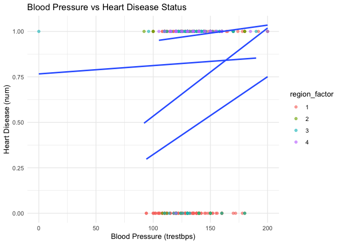
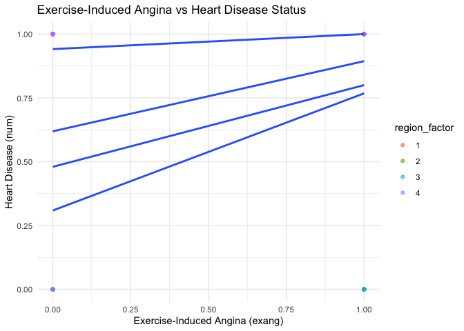
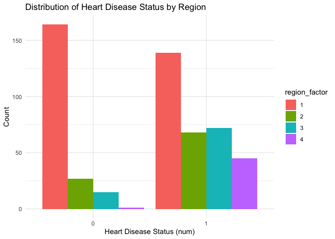
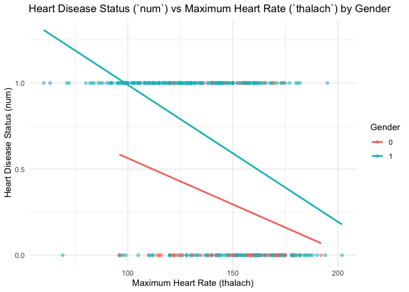
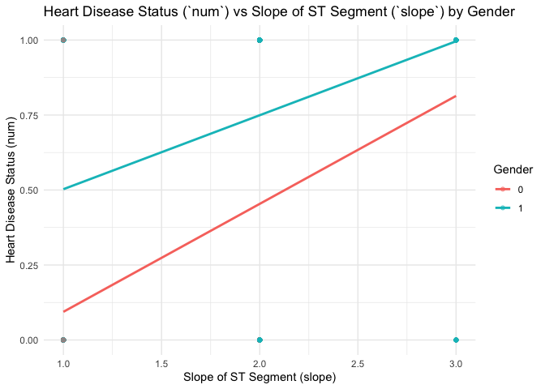
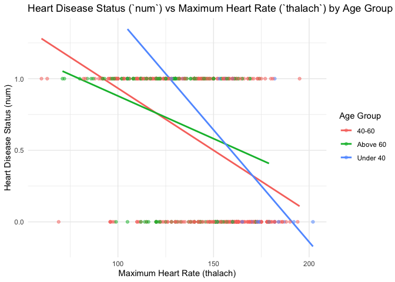
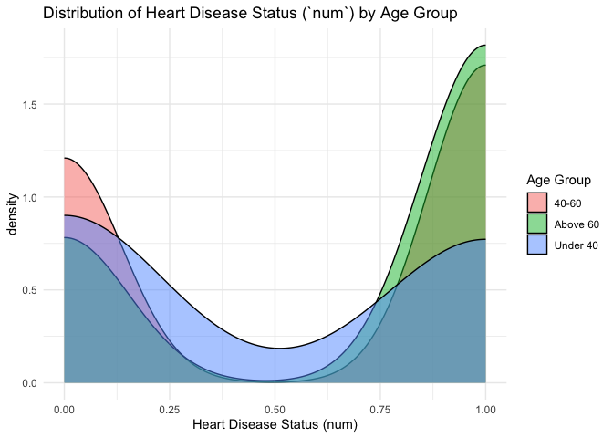
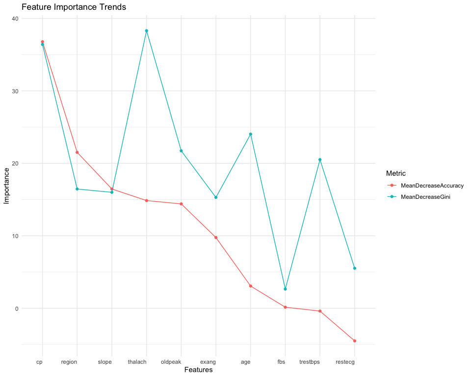
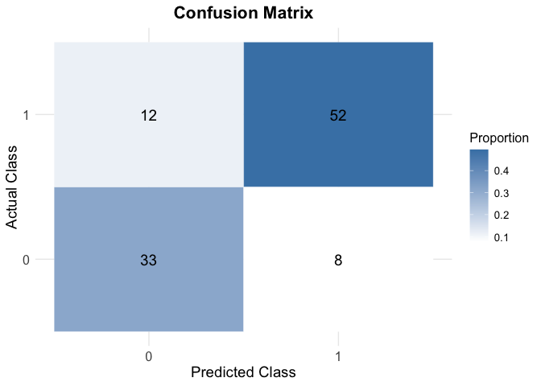
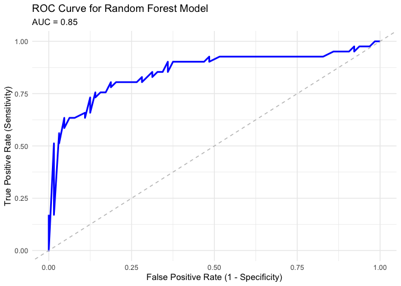

Modelling
================
2024-11-16

``` r
library(tidyverse)
library(janitor)
library(car)
library(skimr)
library(broom)
```

Interpreting num: The values for `num` represent the degree of narrowing
in the coronary arteries: 0: No disease (\< 50% diameter narrowing).
1-4: Increasing severity of disease (\> 50% diameter narrowing, with
different severities).

For convenience, this variable will binarized: 0: No heart disease
(value 0 in num). 1: Presence of heart disease (values 1-4 in num).

\*but if we want to analyze the severity of heart disease num will be
treated as a categorical variable. example code: cleaned_data \<- data
\|\> mutate(num = factor(num, levels = c(0, 1, 2, 3, 4), labels = c(“No
Disease”, “Mild”, “Moderate”, “Severe”, “Very Severe”)))

``` r
cleveland <- read_csv("./data/cleveland.csv", na = "?") |> 
  clean_names() |> 
  mutate(num = if_else(num == 0, 0, 1)) # Binarize the `num` variable: 0 = no heart disease, 1 = heart disease
```

    ## Rows: 303 Columns: 14
    ## ── Column specification ────────────────────────────────────────────────────
    ## Delimiter: ","
    ## dbl (14): age, sex, cp, trestbps, chol, fbs, restecg, thalach, exang, oldpea...
    ## 
    ## ℹ Use `spec()` to retrieve the full column specification for this data.
    ## ℹ Specify the column types or set `show_col_types = FALSE` to quiet this message.

``` r
# |> drop_na() Removes rows with any missing values (optional, adjust as needed)

hungary = read_csv("./data/hungarian.csv", na = "?") |> 
  clean_names() |> 
  mutate(num = if_else(num == 0, 0, 1))
```

    ## Rows: 294 Columns: 14
    ## ── Column specification ────────────────────────────────────────────────────
    ## Delimiter: ","
    ## dbl (14): age, sex, cp, trestbps, chol, fbs, restecg, thalach, exang, oldpea...
    ## 
    ## ℹ Use `spec()` to retrieve the full column specification for this data.
    ## ℹ Specify the column types or set `show_col_types = FALSE` to quiet this message.

``` r
# |> drop_na() Removes rows with any missing values (optional, adjust as needed)

long_beach = read_csv("./data/long_beach_va.csv", na = "?") |> 
  clean_names() |> 
  mutate(num = if_else(num == 0, 0, 1))
```

    ## Rows: 200 Columns: 14
    ## ── Column specification ────────────────────────────────────────────────────
    ## Delimiter: ","
    ## dbl (14): age, sex, cp, trestbps, chol, fbs, restecg, thalach, exang, oldpea...
    ## 
    ## ℹ Use `spec()` to retrieve the full column specification for this data.
    ## ℹ Specify the column types or set `show_col_types = FALSE` to quiet this message.

``` r
# |> drop_na() Removes rows with any missing values (optional, adjust as needed)

switzerland = read_csv("./data/switzerland.csv", na = "?") |> 
  clean_names() |> 
  mutate(num = if_else(num == 0, 0, 1))
```

    ## Rows: 123 Columns: 14
    ## ── Column specification ────────────────────────────────────────────────────
    ## Delimiter: ","
    ## dbl (14): age, sex, cp, trestbps, chol, fbs, restecg, thalach, exang, oldpea...
    ## 
    ## ℹ Use `spec()` to retrieve the full column specification for this data.
    ## ℹ Specify the column types or set `show_col_types = FALSE` to quiet this message.

``` r
# |> drop_na() Removes rows with any missing values (optional, adjust as needed) 
```

``` r
cor(cleveland$chol, cleveland$num, use = "complete.obs")
```

    ## [1] 0.08516361

# Variable Selection (author: Yonghao YU)

author: Yonghao YU

### Data Preprocessing

``` r
cleveland$region = "Cleveland"
hungary$region = "Hungarian"
long_beach$region = "Long_Beach_VA"
switzerland$region = "Switzerland"
combined_data_one = bind_rows(cleveland, hungary, long_beach, switzerland)

colnames(combined_data_one) = c("age", "sex", "cp", "trestbps", "chol", "fbs",
                             "restecg", "thalach", "exang", "oldpeak", "slope",
                             "ca", "thal", "num", "region")
combined_data_two = combined_data_one |>
  mutate(region = case_when(
    region == "Cleveland" ~ 1,
    region == "Hungarian" ~ 2,
    region == "Long_Beach_VA" ~ 3,
    region == "Switzerland" ~ 4,
  )) |>
  select(-thal,-ca) |>
  drop_na()
case_data = combined_data_two |>
  filter(num == 1)
control_data = combined_data_two |>
  filter(num == 0)
print(case_data)
```

    ## # A tibble: 324 × 13
    ##      age   sex    cp trestbps  chol   fbs restecg thalach exang oldpeak slope
    ##    <dbl> <dbl> <dbl>    <dbl> <dbl> <dbl>   <dbl>   <dbl> <dbl>   <dbl> <dbl>
    ##  1    67     1     4      160   286     0       2     108     1     1.5     2
    ##  2    67     1     4      120   229     0       2     129     1     2.6     2
    ##  3    62     0     4      140   268     0       2     160     0     3.6     3
    ##  4    63     1     4      130   254     0       2     147     0     1.4     2
    ##  5    53     1     4      140   203     1       2     155     1     3.1     3
    ##  6    56     1     3      130   256     1       2     142     1     0.6     2
    ##  7    48     1     2      110   229     0       0     168     0     1       3
    ##  8    58     1     2      120   284     0       2     160     0     1.8     2
    ##  9    58     1     3      132   224     0       2     173     0     3.2     1
    ## 10    60     1     4      130   206     0       2     132     1     2.4     2
    ## # ℹ 314 more rows
    ## # ℹ 2 more variables: num <dbl>, region <dbl>

``` r
print(control_data)
```

    ## # A tibble: 207 × 13
    ##      age   sex    cp trestbps  chol   fbs restecg thalach exang oldpeak slope
    ##    <dbl> <dbl> <dbl>    <dbl> <dbl> <dbl>   <dbl>   <dbl> <dbl>   <dbl> <dbl>
    ##  1    63     1     1      145   233     1       2     150     0     2.3     3
    ##  2    37     1     3      130   250     0       0     187     0     3.5     3
    ##  3    41     0     2      130   204     0       2     172     0     1.4     1
    ##  4    56     1     2      120   236     0       0     178     0     0.8     1
    ##  5    57     0     4      120   354     0       0     163     1     0.6     1
    ##  6    57     1     4      140   192     0       0     148     0     0.4     2
    ##  7    56     0     2      140   294     0       2     153     0     1.3     2
    ##  8    44     1     2      120   263     0       0     173     0     0       1
    ##  9    52     1     3      172   199     1       0     162     0     0.5     1
    ## 10    57     1     3      150   168     0       0     174     0     1.6     1
    ## # ℹ 197 more rows
    ## # ℹ 2 more variables: num <dbl>, region <dbl>

``` r
print(combined_data_two)
```

    ## # A tibble: 531 × 13
    ##      age   sex    cp trestbps  chol   fbs restecg thalach exang oldpeak slope
    ##    <dbl> <dbl> <dbl>    <dbl> <dbl> <dbl>   <dbl>   <dbl> <dbl>   <dbl> <dbl>
    ##  1    63     1     1      145   233     1       2     150     0     2.3     3
    ##  2    67     1     4      160   286     0       2     108     1     1.5     2
    ##  3    67     1     4      120   229     0       2     129     1     2.6     2
    ##  4    37     1     3      130   250     0       0     187     0     3.5     3
    ##  5    41     0     2      130   204     0       2     172     0     1.4     1
    ##  6    56     1     2      120   236     0       0     178     0     0.8     1
    ##  7    62     0     4      140   268     0       2     160     0     3.6     3
    ##  8    57     0     4      120   354     0       0     163     1     0.6     1
    ##  9    63     1     4      130   254     0       2     147     0     1.4     2
    ## 10    53     1     4      140   203     1       2     155     1     3.1     3
    ## # ℹ 521 more rows
    ## # ℹ 2 more variables: num <dbl>, region <dbl>

author: Yonghao YU

### For Continuous case

For continuous variables, we use mean and standard deviation (std) to
describe the distribution in overall samples, samples of control(num =
0), and samples of case(num = 1). Then, we use t-test to examine whether
the means of these variables are significantly different between case
group and control group (significance level = 0.05).

``` r
# 1. Mean and Std for Continuous Variables (Overall)
list_conti_all = list(
  age = combined_data_two$age,
  trestbps = combined_data_two$trestbps,
  chol = combined_data_two$chol,
  thalach = combined_data_two$thalach,
  oldpeak = combined_data_two$oldpeak
) |> 
  lapply(na.omit) 

mean_all = sapply(list_conti_all, mean) |> 
  as.data.frame()|>
  setNames("Overall Mean")

std_all = sapply(list_conti_all, sd) |> 
  as.data.frame() |>
  setNames("Overall Std")

# 2. p-value of t-test for Continuous Variables
t_test = function(variable) {
  t_test_result = t.test(combined_data_two[[variable]] ~ combined_data_two$num)
  return(data.frame(
    variable = variable,
    p_value = t_test_result$p.value
  ))
}

p_value = 
  lapply(c("age", "trestbps", "chol", "thalach", "oldpeak"), t_test) |> 
  bind_rows() |> 
  as.data.frame()

# 3. Mean and Std for Control Group
list_conti_control = list(
  age = control_data$age,
  trestbps = control_data$trestbps,
  chol = control_data$chol,
  thalach = control_data$thalach,
  oldpeak = control_data$oldpeak
) |> 
  lapply(na.omit)

mean_control = sapply(list_conti_control, mean) |> 
  as.data.frame() |>
  setNames("Control Mean")

std_control = sapply(list_conti_control, sd) |> 
  as.data.frame() |>
  setNames("Control Std")

# 4. Mean and Std for Case Group
list_conti_case = list(
  age = case_data$age,
  trestbps = case_data$trestbps,
  chol = case_data$chol,
  thalach = case_data$thalach,
  oldpeak = case_data$oldpeak
) |> 
  lapply(na.omit)

mean_case = sapply(list_conti_case, mean) |> 
  as.data.frame() |>
  setNames("Case Mean")

std_case = sapply(list_conti_case, sd) |> 
  as.data.frame() |>
  setNames("Case Std")

conti_des_df =
  as.data.frame(cbind(mean_all, std_all, mean_control, std_control, mean_case, std_case, p_value))
conti_des_df = conti_des_df[, -grep("variable", colnames(conti_des_df))] |> 
  knitr::kable(digits = 6)
conti_des_df
```

|  | Overall Mean | Overall Std | Control Mean | Control Std | Case Mean | Case Std | p_value |
|:---|---:|---:|---:|---:|---:|---:|---:|
| age | 54.843691 | 8.824069 | 52.908213 | 9.248788 | 56.080247 | 8.323177 | 0.000074 |
| trestbps | 133.406780 | 18.969496 | 129.734300 | 16.322060 | 135.753086 | 20.158831 | 0.000179 |
| chol | 216.854991 | 99.014215 | 237.043478 | 68.313903 | 203.956790 | 112.615863 | 0.000030 |
| thalach | 138.463277 | 25.833649 | 152.758454 | 22.958375 | 129.330247 | 23.329890 | 0.000000 |
| oldpeak | 1.218456 | 1.105150 | 0.726087 | 0.805741 | 1.533025 | 1.155598 | 0.000000 |

Based on the result, we can find that all five features are
significantly different between case and control.

author: Yonghao YU

### For Discrete case

For binary and categorical variables, we use count (n) and percentage
(pct) to describe the distribution in overall samples, samples of
control(num = 0), and samples of case(num = 1). Then, as the data meet
the assumption, we use chi-sq test to examine whether the distribution
of these variables are significantly different between case group and
control group (significance level = 0.05).

``` r
list_cat_all = as.data.frame(list(
  sex = combined_data_two$sex,
  cp = combined_data_two$cp,
  fbs = combined_data_two$fbs,
  restecg = combined_data_two$restecg,
  exang = combined_data_two$exang,
  slope = combined_data_two$slope,
  region = combined_data_two$region
))

# 1. Overall Counts and Chi-Square Test
cat_vars = names(list_cat_all)

count_all_function = function(variable) {
  table_value = table(list_cat_all[[variable]], combined_data_two$num) 
  chi_sq_test = chisq.test(table_value)
  
  count = table(list_cat_all[[variable]])
  total = sum(count)
  pct = count / total
  
  result_df = tibble(
    variable = rep(variable, length(count)),
    category = names(count),
    n = as.numeric(count),
    pct = round(pct, 3),
    p_value = round(chi_sq_test$p.value, 3)
  )
  
  return(result_df)
}

cat_count_chisq = lapply(cat_vars, count_all_function) |> 
  bind_rows()

# 2. Control Group Counts and Percentages
list_cat_ctrl = as.data.frame(list(
  sex = control_data$sex,
  cp = control_data$cp,
  fbs = control_data$fbs,
  restecg = control_data$restecg,
  exang = control_data$exang,
  slope = control_data$slope,
  region = control_data$region
))

cat_vars_ctrl = names(list_cat_ctrl)

count_ctrl_function = function(variable) {
  count = table(list_cat_ctrl[[variable]])
  total = sum(count)
  pct = count / total
  
  result_df = tibble(
    variable = rep(variable, length(count)),
    category = names(count),
    control_n = as.numeric(count),
    control_pct = round(pct, 3)
  )
  
  return(result_df)
}

cat_count_ctrl = lapply(cat_vars_ctrl, count_ctrl_function) |> 
  bind_rows()

# 3. Case Group Counts and Percentages
list_cat_case = as.data.frame(list(
  sex = case_data$sex,
  cp = case_data$cp,
  fbs = case_data$fbs,
  restecg = case_data$restecg,
  exang = case_data$exang,
  slope = case_data$slope,
  region = case_data$region
))

cat_vars_case = names(list_cat_case)

count_case_function = function(variable) {
  count = table(list_cat_case[[variable]])
  total = sum(count)
  pct = count / total
  
  result_df = tibble(
    variable = rep(variable, length(count)),
    category = names(count),
    case_n = as.numeric(count),
    case_pct = round(pct, 3)
  )
  return(result_df)
}

cat_count_case = lapply(cat_vars_case, count_case_function) |> 
  bind_rows()

# 4. Combine Results
final_cat_count = cat_count_chisq |>
  left_join(cat_count_ctrl, by = c("variable", "category")) |>
  left_join(cat_count_case, by = c("variable", "category"))|>
  knitr::kable(digits = 3)

print(final_cat_count)
```

    ## 
    ## 
    ## |variable |category |   n|   pct| p_value| control_n| control_pct| case_n| case_pct|
    ## |:--------|:--------|---:|-----:|-------:|---------:|-----------:|------:|--------:|
    ## |sex      |0        | 127| 0.239|   0.000|        87|       0.420|     40|    0.123|
    ## |sex      |1        | 404| 0.761|   0.000|       120|       0.580|    284|    0.877|
    ## |cp       |1        |  30| 0.056|   0.000|        18|       0.087|     12|    0.037|
    ## |cp       |2        |  70| 0.132|   0.000|        51|       0.246|     19|    0.059|
    ## |cp       |3        | 114| 0.215|   0.000|        80|       0.386|     34|    0.105|
    ## |cp       |4        | 317| 0.597|   0.000|        58|       0.280|    259|    0.799|
    ## |fbs      |0        | 446| 0.840|   0.378|       178|       0.860|    268|    0.827|
    ## |fbs      |1        |  85| 0.160|   0.378|        29|       0.140|     56|    0.173|
    ## |restecg  |0        | 297| 0.559|   0.000|       123|       0.594|    174|    0.537|
    ## |restecg  |1        |  73| 0.137|   0.000|        13|       0.063|     60|    0.185|
    ## |restecg  |2        | 161| 0.303|   0.000|        71|       0.343|     90|    0.278|
    ## |exang    |0        | 267| 0.503|   0.000|       163|       0.787|    104|    0.321|
    ## |exang    |1        | 264| 0.497|   0.000|        44|       0.213|    220|    0.679|
    ## |slope    |1        | 173| 0.326|   0.000|       119|       0.575|     54|    0.167|
    ## |slope    |2        | 310| 0.584|   0.000|        76|       0.367|    234|    0.722|
    ## |slope    |3        |  48| 0.090|   0.000|        12|       0.058|     36|    0.111|
    ## |region   |1        | 303| 0.571|   0.000|       164|       0.792|    139|    0.429|
    ## |region   |2        |  95| 0.179|   0.000|        27|       0.130|     68|    0.210|
    ## |region   |3        |  87| 0.164|   0.000|        15|       0.072|     72|    0.222|
    ## |region   |4        |  46| 0.087|   0.000|         1|       0.005|     45|    0.139|

Based on the result, we can find that except fbs, the rest of all other
binary and categorical features are significantly different between case
and control.

# Linear Regression

(author: Yixin Zheng)

Here we are prioritizing MLR over SLR, as the nature of heart disease
involves multiple interacting factors (e.g., age, chest pain, and
exercise-induced angina). Modeling a single variable may oversimplify
these relationships and fail to capture their combined effects. For
example, maximum heart rate (thalach) may interact with age or region,
making it more meaningful to include these interactions in a multiple
linear regression (MLR) model.

1.  Comparing Diagnostic Factors for Heart Disease Across Regions
    Explore whether certain diagnostic factors (e.g., blood pressure and
    exercise-induced angina) are more predictive of heart disease in one
    region compared to others.

Due to the high number of missing values in the `chol` column
(particularly in Switzerland), alternative predictors should be used for
analysis. Include an interaction term between the diagnostic factor and
region to capture regional differences.

## checking datasets

``` r
# Add numeric encoding for regions
region_data <- combined_data_two %>%
  mutate(region_factor = as.factor(region))

ggplot(region_data, aes(x = trestbps, y = num)) +
  geom_point(aes(color = region_factor), alpha = 0.6) +
  geom_smooth(method = "lm", se = FALSE, aes(group = region_factor)) +
  labs(title = "Blood Pressure vs Heart Disease Status", 
       x = "Blood Pressure (trestbps)", 
       y = "Heart Disease (num)") +
  theme_minimal()
```

    ## `geom_smooth()` using formula = 'y ~ x'

<!-- -->

``` r
ggplot(region_data, aes(x = exang, y = num)) +
  geom_point(aes(color = region_factor), alpha = 0.6) +
  geom_smooth(method = "lm", se = FALSE, aes(group = region_factor)) +
  labs(title = "Exercise-Induced Angina vs Heart Disease Status", 
       x = "Exercise-Induced Angina (exang)", 
       y = "Heart Disease (num)") +
  theme_minimal()
```

    ## `geom_smooth()` using formula = 'y ~ x'

<!-- -->

``` r
ggplot(region_data, aes(x = factor(num))) +
  geom_bar(aes(fill = region_factor), position = "dodge") +
  labs(title = "Distribution of Heart Disease Status by Region", 
       x = "Heart Disease Status (num)", 
       y = "Count") +
  theme_minimal()
```

<!-- -->

Scatterplots of Resting Blood Pressure (trestbps) show variability in
the relationship between trestbps and heart disease across regions,
justifying the inclusion of interaction terms. Plot for Exercise-Induced
Angina (exang) is consistent within regions but varying slopes between
regions highlight the importance of interaction effects. Plot of
prevalence of Heart Disease (num) shows substantial differences in
baseline heart disease prevalence across regions further support
modeling regional effects.

## Hypothesis (MLR):

Null Hypothesis ($H_0$: Blood pressure (`trestbps`) and exercise-induced
angina (`exang`) do not significantly predict heart disease(`num`), and
the relationship does not vary across regions.

Alternative Hypothesis ($H_a$): At least one of these predictors
significantly impacts heart disease, and the relationship differs by
region.

$$ num = \beta_0 + \beta_1 \cdot \text{trestbps} + \beta_2 \cdot \text{exang} + \beta_3 \cdot \text{region} + \beta_4 \cdot \text{(trestbps*region)} + \beta_5 \cdot \text{(exang*region)} + \epsilon $$

``` r
# fit the model with interaction terms
region_model <- lm(num ~ trestbps * region_factor + exang * region_factor, data = region_data)

# summarize the model
region_model_summary <- broom::tidy(region_model)
region_model_summary
```

    ## # A tibble: 12 × 5
    ##    term                      estimate std.error statistic  p.value
    ##    <chr>                        <dbl>     <dbl>     <dbl>    <dbl>
    ##  1 (Intercept)             -0.149       0.180     -0.828  4.08e- 1
    ##  2 trestbps                 0.00350     0.00136    2.58   1.03e- 2
    ##  3 region_factor2           0.165       0.365      0.451  6.52e- 1
    ##  4 region_factor3           0.927       0.324      2.86   4.39e- 3
    ##  5 region_factor4           1.01        0.460      2.20   2.86e- 2
    ##  6 exang                    0.450       0.0509     8.85   1.37e-17
    ##  7 trestbps:region_factor2  0.0000304   0.00270    0.0113 9.91e- 1
    ##  8 trestbps:region_factor3 -0.00481     0.00249   -1.93   5.45e- 2
    ##  9 trestbps:region_factor4 -0.00289     0.00343   -0.842  4.00e- 1
    ## 10 region_factor2:exang    -0.159       0.111     -1.43   1.53e- 1
    ## 11 region_factor3:exang    -0.154       0.121     -1.28   2.02e- 1
    ## 12 region_factor4:exang    -0.397       0.139     -2.85   4.49e- 3

``` r
# Test significance of interaction terms
anova(region_model)
```

    ## Analysis of Variance Table
    ## 
    ## Response: num
    ##                         Df Sum Sq Mean Sq F value    Pr(>F)    
    ## trestbps                 1  3.030  3.0302 17.6341 3.151e-05 ***
    ## region_factor            3 17.205  5.7351 33.3748 < 2.2e-16 ***
    ## exang                    1 14.190 14.1902 82.5789 < 2.2e-16 ***
    ## trestbps:region_factor   3  1.053  0.3511  2.0430   0.10689    
    ## region_factor:exang      3  1.642  0.5474  3.1858   0.02355 *  
    ## Residuals              519 89.184  0.1718                      
    ## ---
    ## Signif. codes:  0 '***' 0.001 '**' 0.01 '*' 0.05 '.' 0.1 ' ' 1

From the code result, we see that - `trestbps` is positive
($\beta_1 = 0.0035$) and significant with p = 0.01027, indicating higher
resting blood pressure modestly increases the likelihood of heart
disease. - `exang` is positive ($\beta_2 = 0.4504$) and highly
significant with p \< 2\*10^-16, suggesting that individuals with
exercise-induced angina are more likely to have heart disease. -
`region_factor` shows significant differences in the baseline likelihood
of heart disease across regions: Baseline risk is higher in
`Region 3 - Long Beach` ($\beta = 0.9268$, p = 0.00439) and
`Region 4 - Switzerland` ($\beta = 1.010$, p = 0.02857) compared to
Cleveland. Significant interaction for `exang * region` (p = 0.02355),
Lower impact of exercise-induced angina in Switzerland
($\beta = -0.3967$, p = 0.00449). Interaction for `trestbps * region` is
marginal (p=0.10689), with some variability in Region 3 (Long Beach,
p=0.05446).

2.  Examining Predictive Power of Clinical Indicators for Heart Disease
    in Diverse Populations Investigate how gender and age group modify
    the relationships between key predictors and heart disease.

## checking datasets

``` r
# Refine age groups
age_group_data <- combined_data_two %>%
  mutate(age_group = case_when(
    age < 40 ~ "Under 40",
    age >= 40 & age <= 60 ~ "40-60",
    age > 60 ~ "Above 60"
  ))

ggplot(age_group_data, aes(x = thalach, y = num, color = as.factor(sex))) +
  geom_point(alpha = 0.5) +
  geom_smooth(method = "lm", se = FALSE, aes(group = sex)) +
  labs(
    title = "Heart Disease Status (`num`) vs Maximum Heart Rate (`thalach`) by Gender",
    x = "Maximum Heart Rate (thalach)",
    y = "Heart Disease Status (num)",
    color = "Gender"
  ) +
  theme_minimal()
```

    ## `geom_smooth()` using formula = 'y ~ x'

<!-- -->

``` r
ggplot(age_group_data, aes(x = slope, y = num, color = as.factor(sex))) +
  geom_point(alpha = 0.5) +
  geom_smooth(method = "lm", se = FALSE, aes(group = sex)) +
  labs(
    title = "Heart Disease Status (`num`) vs Slope of ST Segment (`slope`) by Gender",
    x = "Slope of ST Segment (slope)",
    y = "Heart Disease Status (num)",
    color = "Gender"
  ) +
  theme_minimal()
```

    ## `geom_smooth()` using formula = 'y ~ x'

<!-- -->

``` r
ggplot(age_group_data, aes(x = num, fill = as.factor(sex))) +
  geom_density(alpha = 0.5) +
  labs(
    title = "Distribution of Heart Disease Status (`num`) by Gender",
    x = "Heart Disease Status (num)",
    fill = "Gender"
  ) +
  theme_minimal()
```

<!-- -->

A negative trend between thalach and heart disease status is visible for
both genders, with a steeper decline for males. This indicates that
lower maximum heart rate is more predictive of heart disease in males.
The relationship between slope and heart disease shows distinct patterns
across genders. Males have a stronger positive association between
higher slope values and the presence of heart disease. Heart disease
status distribution (num) differs between genders, with males (gender=1)
showing a higher density near num=1 (presence of heart disease). This
aligns with previous findings of gender disparities in heart disease
prevalence.

``` r
ggplot(age_group_data, aes(x = thalach, y = num, color = age_group)) +
  geom_smooth(method = "lm", se = FALSE, aes(group = age_group)) +
  geom_point(alpha = 0.5) +
  labs(
    title = "Heart Disease Status (`num`) vs Maximum Heart Rate (`thalach`) by Age Group",
    x = "Maximum Heart Rate (thalach)",
    y = "Heart Disease Status (num)",
    color = "Age Group"
  ) +
  theme_minimal()
```

    ## `geom_smooth()` using formula = 'y ~ x'

<!-- -->

``` r
ggplot(age_group_data, aes(x = slope, y = num, color = age_group)) +
  geom_smooth(method = "lm", se = FALSE, aes(group = age_group)) +
  geom_point(alpha = 0.5) +
  labs(
    title = "Heart Disease Status (`num`) vs Slope of ST Segment (`slope`) by Age Group",
    x = "Slope of ST Segment (slope)",
    y = "Heart Disease Status (num)",
    color = "Age Group"
  ) +
  theme_minimal()
```

    ## `geom_smooth()` using formula = 'y ~ x'

<!-- -->

``` r
ggplot(age_group_data, aes(x = num, fill = age_group)) +
  geom_density(alpha = 0.5) +
  labs(
    title = "Distribution of Heart Disease Status (`num`) by Age Group",
    x = "Heart Disease Status (num)",
    fill = "Age Group"
  ) +
  theme_minimal()
```

<!-- --> A negative
association is evident across all age groups, but the trend is most
pronounced for the 40-60 age group. For individuals under 40 and above
60, the association is weaker, potentially due to smaller sample sizes
or varying risk factors. Similar trends are observed across age groups,
with higher slope values generally predicting heart disease. The
relationship is strongest in the 40-60 age group, which also has the
largest sample size. The distribution of heart disease status differs by
age group. Individuals aged 40-60 have the highest density near num=1
(presence of heart disease), reflecting their higher overall risk in
this dataset.

\##Hypothesis 1 (MLR): - **Null Hypothesis (H_0):** The relationships
between maximum heart rate (`thalach`), the slope of the ST segment
(`slope`), and heart disease status (`num`) do not vary by gender -
**Alternative Hypothesis (H_a):** At least one of these predictors
interacts with gender to significantly influence heart disease status.

$$ num = \beta_0 + \beta_1 \cdot \text{thalach} + \beta_2 \cdot \text{fbs} + \beta_3 \cdot \text{slope} + \beta_4 \cdot \text{sex} + \beta_5 \cdot \text{thalach*sex} + \beta_6  \cdot  \text{slope*sex} + \epsilon $$
`thalach` and `slope` were identified as strong predictors in logistic
regression and EDA. `fbs` has weaker significance and may be excluded in
a stepwise selection process.

\##Hypothesis 2 (MLR): - **Null Hypothesis (H_0):** The relationships
between maximum heart rate (`thalach`), the slope of the ST segment
(`slope`), and heart disease status (`num`) do not vary by age group -
**Alternative Hypothesis (H_a):** At least one of these predictors
interacts with age group to significantly influence heart disease
status.
$$ num = \beta_0 + \beta_1 \cdot \text{thalach} + \beta_2 \cdot \text{fbs} + \beta_3 \cdot \text{slope} + \beta_4 \cdot \text{age_group} + \beta_5 \cdot \text{thalach*age_group} + \beta_6 \cdot \text{slope*age_group} + \epsilon $$

``` r
# Separate the data by gender
male_data <- combined_data_two %>% filter(sex == 1)
female_data <- combined_data_two %>% filter(sex == 0)

# Fit the model with interaction terms for gender
gender_model <- lm(num ~ thalach * sex + slope * sex + fbs, data = combined_data_two)

# Summarize the model results
gender_model_summary <- broom::tidy(gender_model)
gender_model_summary
```

    ## # A tibble: 7 × 5
    ##   term        estimate std.error statistic    p.value
    ##   <chr>          <dbl>     <dbl>     <dbl>      <dbl>
    ## 1 (Intercept)  0.165     0.310       0.532 0.595     
    ## 2 thalach     -0.00261   0.00174    -1.50  0.133     
    ## 3 sex          1.22      0.346       3.54  0.000436  
    ## 4 slope        0.328     0.0677      4.84  0.00000169
    ## 5 fbs          0.0226    0.0487      0.463 0.644     
    ## 6 thalach:sex -0.00421   0.00193    -2.19  0.0292    
    ## 7 sex:slope   -0.196     0.0771     -2.55  0.0111

``` r
# Test the significance of interaction terms
anova(gender_model)
```

    ## Analysis of Variance Table
    ## 
    ## Response: num
    ##              Df Sum Sq Mean Sq  F value    Pr(>F)    
    ## thalach       1 24.756 24.7555 150.8110 < 2.2e-16 ***
    ## sex           1  9.080  9.0804  55.3179 4.218e-13 ***
    ## slope         1  5.066  5.0658  30.8608 4.416e-08 ***
    ## fbs           1  0.002  0.0015   0.0094   0.92279    
    ## thalach:sex   1  0.322  0.3216   1.9592   0.16219    
    ## sex:slope     1  1.066  1.0659   6.4934   0.01111 *  
    ## Residuals   524 86.014  0.1641                       
    ## ---
    ## Signif. codes:  0 '***' 0.001 '**' 0.01 '*' 0.05 '.' 0.1 ' ' 1

Model Results: Significant Variables: Sex (p \< 0.001): Being male
significantly increases the likelihood of heart disease, with males
having higher odds of heart disease compared to females. Slope (p \<
0.001): A higher slope value (indicating abnormal ST depression) is
associated with an increased likelihood of heart disease. thalach:sex (p
= 0.029): The interaction between heart rate and gender is significant.
This suggests that the relationship between heart rate and heart disease
differs between males and females. Specifically, males may show a
stronger association with heart rate. sex:slope (p = 0.011): The
relationship between the slope of the ST segment and heart disease
differs significantly between males and females, with a stronger
association in males.

The interaction terms `thalach:sex` and `sex:slope` are significant,
indicating that the relationships between thalach and heart disease, as
well as slope and heart disease, differ by gender. Hence, gender
modifies the relationship between clinical indicators and heart disease,
supporting the alternative hypothesis.

``` r
# Summary of the dataset by age group
table(age_group_data$age_group)
```

    ## 
    ##    40-60 Above 60 Under 40 
    ##      362      143       26

``` r
# Fit the model with interaction terms for age group
age_group_model <- lm(num ~ thalach * age_group + slope * age_group + fbs, data = age_group_data)

# Summarize the model results
age_group_summary <- broom::tidy(age_group_model)
age_group_summary
```

    ## # A tibble: 10 × 5
    ##    term                      estimate std.error statistic  p.value
    ##    <chr>                        <dbl>     <dbl>     <dbl>    <dbl>
    ##  1 (Intercept)                1.17     0.176        6.67  6.66e-11
    ##  2 thalach                   -0.00679  0.000945    -7.19  2.29e-12
    ##  3 age_groupAbove 60         -0.156    0.320       -0.486 6.27e- 1
    ##  4 age_groupUnder 40          1.47     0.910        1.62  1.06e- 1
    ##  5 slope                      0.210    0.0420       4.99  8.35e- 7
    ##  6 fbs                        0.0285   0.0511       0.557 5.78e- 1
    ##  7 thalach:age_groupAbove 60  0.00203  0.00188      1.08  2.82e- 1
    ##  8 thalach:age_groupUnder 40 -0.00761  0.00446     -1.71  8.83e- 2
    ##  9 age_groupAbove 60:slope   -0.0517   0.0722      -0.716 4.74e- 1
    ## 10 age_groupUnder 40:slope   -0.124    0.170       -0.728 4.67e- 1

``` r
# Test the significance of interaction terms
anova(age_group_model)
```

    ## Analysis of Variance Table
    ## 
    ## Response: num
    ##                    Df Sum Sq Mean Sq  F value    Pr(>F)    
    ## thalach             1 24.756 24.7555 136.9416 < 2.2e-16 ***
    ## age_group           2  0.151  0.0756   0.4182   0.65846    
    ## slope               1  6.101  6.1012  33.7505 1.091e-08 ***
    ## fbs                 1  0.054  0.0544   0.3010   0.58347    
    ## thalach:age_group   2  0.894  0.4471   2.4732   0.08531 .  
    ## age_group:slope     2  0.165  0.0825   0.4565   0.63377    
    ## Residuals         521 94.183  0.1808                       
    ## ---
    ## Signif. codes:  0 '***' 0.001 '**' 0.01 '*' 0.05 '.' 0.1 ' ' 1

Model Results: Significant Variables: thalach (p \< 0.001): Lower
maximum heart rates are consistently associated with a higher likelihood
of heart disease, regardless of age group. Slope (p \< 0.001): A steeper
ST segment slope is associated with a higher likelihood of heart
disease, with a stronger association across age groups. Age Group (Above
60) (p = 0.203): The effect of being above 60 years old is not
significant, suggesting that this group does not have a significantly
different relationship with heart disease compared to the 40-60 group.
Age Group (Under 40) (p = 0.103): Similar to the above-60 group, the
under-40 age group shows a marginally non-significant relationship with
heart disease.

Interaction Effects: thalach:age_groupAbove 60 (p = 0.168): This
interaction is non-significant, indicating that the effect of heart rate
on heart disease does not vary significantly for individuals over 60.
thalach:age_groupUnder 40 (p = 0.113): The interaction between heart
rate and being under 40 is marginally non-significant, suggesting only a
weak difference in how heart rate affects heart disease for younger
individuals.

Therefore, age does not modify the relationship between heart rate,
slope, and heart disease in a statistically significant way. This does
not support the alternative hypothesis, and the null hypothesis cannot
be rejected.

``` r
# Stepwise selection for the gender interaction model
stepwise_gender_model <- step(gender_model, direction = "both")
```

    ## Start:  AIC=-952.55
    ## num ~ thalach * sex + slope * sex + fbs
    ## 
    ##               Df Sum of Sq    RSS     AIC
    ## - fbs          1   0.03520 86.050 -954.33
    ## <none>                     86.014 -952.55
    ## - thalach:sex  1   0.78456 86.799 -949.73
    ## - sex:slope    1   1.06589 87.080 -948.01
    ## 
    ## Step:  AIC=-954.33
    ## num ~ thalach + sex + slope + thalach:sex + sex:slope
    ## 
    ##               Df Sum of Sq    RSS     AIC
    ## <none>                     86.050 -954.33
    ## + fbs          1   0.03520 86.014 -952.55
    ## - thalach:sex  1   0.75965 86.809 -951.67
    ## - sex:slope    1   1.03649 87.086 -949.98

``` r
# Summarize the stepwise model results
stepwise_gender_summary <- broom::tidy(stepwise_gender_model)
stepwise_gender_summary
```

    ## # A tibble: 6 × 5
    ##   term        estimate std.error statistic    p.value
    ##   <chr>          <dbl>     <dbl>     <dbl>      <dbl>
    ## 1 (Intercept)  0.178     0.309       0.576 0.565     
    ## 2 thalach     -0.00266   0.00173    -1.54  0.124     
    ## 3 sex          1.21      0.343       3.51  0.000482  
    ## 4 slope        0.326     0.0676      4.83  0.00000180
    ## 5 thalach:sex -0.00413   0.00192    -2.15  0.0318    
    ## 6 sex:slope   -0.193     0.0766     -2.51  0.0122

``` r
# Stepwise selection for the age group interaction model
stepwise_age_group_model <- step(age_group_model, direction = "both")
```

    ## Start:  AIC=-898.37
    ## num ~ thalach * age_group + slope * age_group + fbs
    ## 
    ##                     Df Sum of Sq    RSS     AIC
    ## - age_group:slope    2   0.16503 94.349 -901.44
    ## - fbs                1   0.05602 94.240 -900.06
    ## <none>                           94.183 -898.37
    ## - thalach:age_group  2   0.81660 95.000 -897.79
    ## 
    ## Step:  AIC=-901.44
    ## num ~ thalach + age_group + slope + fbs + thalach:age_group
    ## 
    ##                     Df Sum of Sq    RSS     AIC
    ## - fbs                1    0.0519 94.400 -903.15
    ## <none>                           94.349 -901.44
    ## - thalach:age_group  2    0.8942 95.243 -900.44
    ## + age_group:slope    2    0.1650 94.183 -898.37
    ## - slope              1    5.6478 99.996 -872.57
    ## 
    ## Step:  AIC=-903.15
    ## num ~ thalach + age_group + slope + thalach:age_group
    ## 
    ##                     Df Sum of Sq     RSS     AIC
    ## <none>                            94.400 -903.15
    ## - thalach:age_group  2    0.8966  95.297 -902.13
    ## + fbs                1    0.0519  94.349 -901.44
    ## + age_group:slope    2    0.1610  94.240 -900.06
    ## - slope              1    5.8231 100.224 -873.37

``` r
# Summarize the stepwise model results
stepwise_age_group_summary <- broom::tidy(stepwise_age_group_model)
stepwise_age_group_summary
```

    ## # A tibble: 7 × 5
    ##   term                      estimate std.error statistic  p.value
    ##   <chr>                        <dbl>     <dbl>     <dbl>    <dbl>
    ## 1 (Intercept)                1.23     0.158         7.79 3.52e-14
    ## 2 thalach                   -0.00696  0.000914     -7.61 1.26e-13
    ## 3 age_groupAbove 60         -0.306    0.240        -1.27 2.03e- 1
    ## 4 age_groupUnder 40          0.989    0.605         1.63 1.03e- 1
    ## 5 slope                      0.190    0.0334        5.69 2.17e- 8
    ## 6 thalach:age_groupAbove 60  0.00247  0.00179       1.38 1.68e- 1
    ## 7 thalach:age_groupUnder 40 -0.00593  0.00373      -1.59 1.13e- 1

For the gender interaction model: The stepwise selection process
retained thalach, sex, slope, and their interactions (`thalach:sex` and
`sex:slope`) as significant predictors. The model explains 31.87% of the
variance in heart disease status, with a highly significant F-statistic.
This suggests that the significant interactions between gender and
clinical indicators (heart rate and slope) are important predictors for
heart disease. So the final model should be
$$ num = \beta_0 + \beta_1 \cdot \text{thalach} + \beta_2 \cdot \text{slope} + \beta_3 \cdot \text{sex} + \beta_4 \cdot \text{thalach*sex} + \beta_5  \cdot \text{slope*sex} + \epsilon $$

For the age group interaction model: After stepwise selection, the final
model includes thalach, age_group, slope, and `thalach:age_group`. The
model explains 25.26% of the variance, with significant contributions
from thalach and slope. However, the interaction terms
(thalach:age_group) are not significant, confirming that age group does
not substantially modify the relationships between heart disease and
these clinical indicators. So the final model should be
$$ num = \beta_0 + \beta_1 \cdot \text{thalach} + \beta_2 \cdot \text{slope} + \beta_3 \cdot \text{age_group} + \beta_4 \cdot \text{thalach*age_group}+ \epsilon $$
Given that num (heart disease status) is binary, future analyses should
consider logistic regression for more accurate risk prediction based on
diagnostic factors across regions/ demographics.

# Logistic Regression Analyses

author: Thomas Tang

``` r
cleveland <- read.csv("./data/cleveland.csv", header = FALSE)
hungarian <- read.csv("./data/hungarian.csv", header = FALSE)
long_beach <- read.csv("./data/long_beach_va.csv", header = FALSE)
switzerland <- read.csv("./data/switzerland.csv", header = FALSE)

# Add region column and combine datasets
cleveland$region <- "Cleveland"
hungarian$region <- "Hungarian"
long_beach$region <- "Long_Beach_VA"
switzerland$region <- "Switzerland"
combined_data <- bind_rows(cleveland, hungarian, long_beach, switzerland)

colnames(combined_data) <- c("age", "sex", "cp", "trestbps", "chol", "fbs",
                             "restecg", "thalach", "exang", "oldpeak", "slope",
                             "ca", "thal", "num", "region")
combined_data <- combined_data %>%
  mutate(across(c(age, sex, cp, trestbps, chol, fbs, restecg, thalach,
                  exang, oldpeak, slope, ca, thal, num), as.numeric))
```

    ## Warning: There were 14 warnings in `mutate()`.
    ## The first warning was:
    ## ℹ In argument: `across(...)`.
    ## Caused by warning:
    ## ! NAs introduced by coercion
    ## ℹ Run `dplyr::last_dplyr_warnings()` to see the 13 remaining warnings.

Dropped variables with excessive missing values (ca and thal).

Removed rows with missing values in critical variables.

Converted num to binary (0 = no heart disease, 1 = heart disease) and
set as a factor.

``` r
# Clean the data
critical_columns <- c("num", "age", "sex", "cp", "trestbps", "chol",
                      "fbs", "restecg", "thalach", "exang", "oldpeak", 
                      "slope", "region")

cleaned_data <- combined_data %>% 
  select(all_of(critical_columns)) %>% 
  drop_na()  # Drop rows with NA values in the critical columns

# Recode 'num' as a binary factor
cleaned_data <- cleaned_data %>%
  mutate(num = as.factor(ifelse(num > 0, 1, 0)))

logistic_model <- glm(num ~ age + sex + cp + trestbps + chol + fbs +
                      restecg + thalach + exang + oldpeak + region,
                      data = cleaned_data, family = binomial)

logistic_summary <- broom::tidy(logistic_model)
logistic_summary
```

    ## # A tibble: 14 × 5
    ##    term                estimate std.error statistic     p.value
    ##    <chr>                  <dbl>     <dbl>     <dbl>       <dbl>
    ##  1 (Intercept)         -4.53      1.81       -2.51  0.0122     
    ##  2 age                  0.0162    0.0161      1.00  0.315      
    ##  3 sex                  1.47      0.292       5.03  0.000000487
    ##  4 cp                   0.668     0.139       4.81  0.00000152 
    ##  5 trestbps             0.00987   0.00711     1.39  0.165      
    ##  6 chol                 0.00110   0.00182     0.607 0.544      
    ##  7 fbs                  0.0897    0.342       0.262 0.793      
    ##  8 restecg              0.167     0.142       1.18  0.239      
    ##  9 thalach             -0.0161    0.00637    -2.52  0.0116     
    ## 10 exang                0.900     0.279       3.22  0.00129    
    ## 11 oldpeak              0.696     0.136       5.11  0.000000329
    ## 12 regionHungarian      0.179     0.387       0.463 0.644      
    ## 13 regionLong_Beach_VA  0.121     0.436       0.277 0.782      
    ## 14 regionSwitzerland    3.84      1.16        3.31  0.000945

Significant Predictors (p-value \< 0.05):

sex (1.409350): *Being male increases the log-odds of heart disease
significantly.*

cp (chest pain): *Higher chest pain levels increase the log-odds of
heart disease.*

thalach (max heart rate achieved): *Higher heart rates decrease the
log-odds of heart disease.*

exang (exercise-induced angina): *Presence of exercise-induced angina
increases the odds of heart disease.*

oldpeak (ST depression): *Higher ST depression values significantly
increase the odds of heart disease.*

regionSwitzerland: *Patients from Switzerland have significantly higher
odds of heart disease compared to the reference region (Cleveland).*

Non-Significant Predictors (p-value \> 0.05): age, trestbps (resting
blood pressure), chol (cholesterol), fbs (fasting blood sugar), restecg
(resting ECG results), regionHungarian, regionLong_Beach_VA.

Regional Effects: Patients from Switzerland have much higher odds of
heart disease compared to Cleveland, Hungarian and Long Beach VA.

### Separated by region:

``` r
extract_results <- function(model, region) {
  if (inherits(model, "try-error")) {
    return(data.frame(
      Region = region,
      Variable = NA,
      Estimate = NA,
      Std_Error = NA,
      P_Value = NA
    ))
  }
  
  coefficients <- tryCatch({
    summary(model)$coefficients
  }, error = function(e) {
    return(NULL)
  })
  
  if (is.null(coefficients)) {
    return(data.frame(
      Region = region,
      Variable = NA,
      Estimate = NA,
      Std_Error = NA,
      P_Value = NA
    ))
  }
  
  data.frame(
    Region = region,
    Variable = rownames(coefficients),
    Estimate = coefficients[, "Estimate"],
    Std_Error = coefficients[, "Std. Error"],
    P_Value = coefficients[, "Pr(>|z|)"]
  )
}

# Filter data for each region
cleveland_data <- cleaned_data %>% filter(region == "Cleveland")
hungarian_data <- cleaned_data %>% filter(region == "Hungarian")
long_beach_data <- cleaned_data %>% filter(region == "Long_Beach_VA")
switzerland_data <- cleaned_data %>% filter(region == "Switzerland")

# Fit logistic regression models
cleveland_model <- glm(num ~ age + sex + cp + trestbps + chol + fbs +
                       restecg + thalach + exang + oldpeak,
                       data = cleveland_data, family = binomial)
hungarian_model <- glm(num ~ age + sex + cp + trestbps + chol + fbs +
                       restecg + thalach + exang + oldpeak,
                       data = hungarian_data, family = binomial)
long_beach_model <- glm(num ~ age + sex + cp + trestbps + chol + fbs +
                        restecg + thalach + exang + oldpeak,
                        data = long_beach_data, family = binomial)
switzerland_model <- glm(num ~ age + sex + cp + trestbps + chol + fbs +
                         restecg + thalach + exang + oldpeak,
                         data = switzerland_data, family = binomial)
```

    ## Warning: glm.fit: algorithm did not converge

    ## Warning: glm.fit: fitted probabilities numerically 0 or 1 occurred

``` r
# Extract results for each region
cleveland_results <- extract_results(cleveland_model, "Cleveland")
hungarian_results <- extract_results(hungarian_model, "Hungarian")
long_beach_results <- extract_results(long_beach_model, "Long_Beach_VA")
switzerland_results <- extract_results(switzerland_model, "Switzerland")

# Combine results
regional_results <- bind_rows(cleveland_results, hungarian_results,
                               long_beach_results, switzerland_results)

# View the consolidated results
regional_results
```

    ##          Region Variable Estimate Std_Error P_Value
    ## 1     Cleveland       NA       NA        NA      NA
    ## 2     Hungarian       NA       NA        NA      NA
    ## 3 Long_Beach_VA       NA       NA        NA      NA
    ## 4   Switzerland       NA       NA        NA      NA

The logistic regression analysis separated by region failed due to
insufficient sample sizes within each region. Logistic regression
requires an adequate number of observations to produce reliable
estimates. When the data was split by region, the limited number of
cases led to unstable coefficients, inflated errors, and convergence
issues. This highlights that the sample size per region was too small
for meaningful analysis.

### Separated by gender:

``` r
# Filter data for males and females
male_data <- cleaned_data %>% filter(sex == 1)
female_data <- cleaned_data %>% filter(sex == 0)

# Fit logistic regression models
male_model <- glm(num ~ age + cp + trestbps + chol + fbs +
                  restecg + thalach + exang + oldpeak,
                  data = male_data, family = binomial)
female_model <- glm(num ~ age + cp + trestbps + chol + fbs +
                    restecg + thalach + exang + oldpeak,
                    data = female_data, family = binomial)

# Function to extract model results
extract_results <- function(model, gender) {
  if (inherits(model, "try-error")) {
    return(data.frame(
      Gender = gender,
      Variable = NA,
      Estimate = NA,
      Std_Error = NA,
      P_Value = NA
    ))
  }
  
  coefficients <- tryCatch({
    summary(model)$coefficients
  }, error = function(e) {
    return(NULL)
  })
  
  if (is.null(coefficients)) {
    return(data.frame(
      Gender = gender,
      Variable = NA,
      Estimate = NA,
      Std_Error = NA,
      P_Value = NA
    ))
  }
  
  data.frame(
    Gender = gender,
    Variable = rownames(coefficients),
    Estimate = coefficients[, "Estimate"],
    Std_Error = coefficients[, "Std. Error"],
    P_Value = coefficients[, "Pr(>|z|)"]
  )
}

# Extract results for males and females
male_results <- extract_results(male_model, "Male")
female_results <- extract_results(female_model, "Female")

# Combine results into a single data frame
gender_results <- bind_rows(male_results, female_results)

# View the results
gender_results
```

    ##   Gender Variable Estimate Std_Error P_Value
    ## 1   Male       NA       NA        NA      NA
    ## 2 Female       NA       NA        NA      NA

Males Significant Predictors (p-value \< 0.05):

Chest Pain (cp): Higher chest pain levels increase the odds of heart
disease.

Max Heart Rate (thalach): Higher maximum heart rates reduce the odds of
heart disease.

Exercise-Induced Angina (exang): Presence of exercise-induced angina
significantly increases the odds of heart disease.

ST Depression (oldpeak): Higher ST depression significantly increases
the odds of heart disease.

Non-Significant Predictors: age, trestbps, chol, fbs, restecg.

Females Significant Predictors (p-value \< 0.05):

Chest Pain (cp) : Stronger effect than males.

Exercise-Induced Angina (exang) : Stronger effect than males.

ST Depression (oldpeak): Similar effect to males.

Non-Significant Predictors: age, trestbps, chol, fbs, restecg, thalach.

Conclusions Predictors for Both Genders: cp, exang, and oldpeak are
significant predictors for both males and females.

Gender-Specific Differences: Stronger effects of cp and exang in females
suggest potential gender-specific diagnostic markers for heart disease.

(author: Yonghao YU)

## Try Random Forest Classifier!

### A brief intro to Random Forest Algorithm

Random Forest is an ensemble learning algorithm used for classification
and regression tasks. It builds multiple decision trees using bootstrap
sampling (random subsets of data) and selects features randomly at each
split to increase diversity. Each tree predicts independently, and the
final output is determined by majority voting (classification) or
averaging (regression). Random Forest is robust to overfitting, handles
high-dimensional data well, and provides feature importance scores.

### First, construct the model with all predictors and then show the feature importance trends (the trend is descending according to the MeanDecreaseAccuracy)!

author: Yonghao YU

``` r
library(caret)
library(randomForest)

# drop out the variable "ca" and "thal" which are have so many missing values inside
variables = c("cp", "age", "thalach", "oldpeak", "num", "restecg", "fbs","trestbps","region", "slope", "exang")
data = combined_data_two[, variables]        
data$num = as.factor(data$num)

# check and deal with missing data
if (any(is.na(data))) {
  print("Missing value detected")
  data = na.omit(data)
  print("Missing data have been deleted")
}
# split the dataset into training and testing datasets
set.seed(42)
trainIndex = createDataPartition(data$num, p = 0.8, list = FALSE)
trainData = data[trainIndex, ]
testData = data[-trainIndex, ]

# Construct the random forest model
rf_model = randomForest(num ~ ., data = trainData, importance = TRUE)
rf_pred = predict(rf_model, testData)
rf_conf_matrix = confusionMatrix(rf_pred, testData$num)

# Then we show the feature importance trends(The trend is descending according to the MeanDecreaseAccuracy)
var_imp = importance(rf_model)
var_imp_df = as.data.frame(var_imp)
var_imp_df$Variable = rownames(var_imp_df)
rownames(var_imp_df) = NULL
var_imp_df = var_imp_df[order(var_imp_df$MeanDecreaseAccuracy, decreasing = TRUE), ]
ggplot(var_imp_df, aes(x = reorder(Variable, -MeanDecreaseAccuracy))) +
  geom_line(aes(y = MeanDecreaseAccuracy, group = 1, color = "MeanDecreaseAccuracy")) +
  geom_point(aes(y = MeanDecreaseAccuracy, color = "MeanDecreaseAccuracy")) +
  geom_line(aes(y = MeanDecreaseGini, group = 1, color = "MeanDecreaseGini")) +
  geom_point(aes(y = MeanDecreaseGini, color = "MeanDecreaseGini")) +
  labs(title = "Feature Importance Trends",
       x = "Features",
       y = "Importance",
       color = "Metric") +
  theme_minimal() +
  theme(axis.text.x = element_text(angle = 0, hjust = 1))
```

<!-- -->

Then we ranked the predictors descendingly based on the
MeanDecreaseAccuracy which measures the decrease in overall model
accuracy when the variable is permuted. And we show them in a line plot!
Based on the MeanDecreaseAccuracy and MeanDecreaseGini, we can drop out
restecg and fbs predictors that have relatively small impact on our
prediction. And then we can focus on the first seven predictors that
have more impact on our prediction results!

### Then, drop unsignificant features and build the model again, show the confusion matrix

``` r
variables2 = c("cp", "thalach", "oldpeak", "num","trestbps","region","slope", "exang","age")
data2 = combined_data_two[, variables2]
data2$num = as.factor(data2$num)

set.seed(50)

trainIndex2 = createDataPartition(data2$num, p = 0.8, list = FALSE)
trainData2 = data2[trainIndex2, ]
testData2 = data2[-trainIndex2, ]

# Construct the random forest model and evaluate the model results
rf_model2 = randomForest(num ~ ., data = trainData2, importance = TRUE)
rf_pred2 = predict(rf_model2, testData2)
rf_conf_matrix2 = confusionMatrix(rf_pred2, testData2$num)

cm = rf_conf_matrix2$table
cm_df = as.data.frame(cm)
colnames(cm_df) = c("Predicted", "Actual", "Frequency")
cm_df$Proportion = cm_df$Frequency / sum(cm_df$Frequency)

ggplot(data = cm_df, aes(x = Predicted, y = Actual, fill = Proportion)) +
  geom_tile(color = "white") +
  scale_fill_gradient(low = "white", high = "steelblue", name = "Proportion") +
  geom_text(aes(label = Frequency), color = "black", size = 5) +  # Add frequency labels
  labs(
    title = "Confusion Matrix",
    x = "Predicted Class",
    y = "Actual Class"
  ) +
  theme_minimal() +
  theme(
    plot.title = element_text(size = 16, face = "bold", hjust = 0.5),
    axis.text = element_text(size = 12),
    axis.title = element_text(size = 14),
    legend.title = element_text(size = 12),
    legend.text = element_text(size = 10)
  )
```

<!-- -->

### Extracting detailed statistics from the confusion matrix

``` r
stats = rf_conf_matrix2$overall
class_stats = rf_conf_matrix2$byClass

# Displaying overall statistics
cat("Overall Statistics:\n")
```

    ## Overall Statistics:

``` r
cat(sprintf("Accuracy: %.4f\n", stats["Accuracy"]))
```

    ## Accuracy: 0.8095

``` r
cat(sprintf("95%% CI: (%.4f, %.4f)\n", stats["AccuracyLower"], stats["AccuracyUpper"]))
```

    ## 95% CI: (0.7213, 0.8796)

``` r
cat(sprintf("No Information Rate: %.4f\n", stats["AccuracyNull"]))
```

    ## No Information Rate: 0.6095

``` r
cat(sprintf("P-Value [Acc > NIR]: %.6f\n", stats["AccuracyPValue"]))
```

    ## P-Value [Acc > NIR]: 0.000009

``` r
cat(sprintf("Kappa: %.4f\n", stats["Kappa"]))
```

    ## Kappa: 0.6067

``` r
cat(sprintf("Mcnemar's Test P-Value: %.4f\n\n", stats["McnemarPValue"]))
```

    ## Mcnemar's Test P-Value: 0.5023

``` r
# Displaying class-specific statistics
cat("Class-Specific Statistics:\n")
```

    ## Class-Specific Statistics:

``` r
cat(sprintf("Sensitivity: %.4f\n", class_stats["Sensitivity"]))
```

    ## Sensitivity: 0.8049

``` r
cat(sprintf("Specificity: %.4f\n", class_stats["Specificity"]))
```

    ## Specificity: 0.8125

``` r
cat(sprintf("Pos Pred Value: %.4f\n", class_stats["Pos Pred Value"]))
```

    ## Pos Pred Value: 0.7333

``` r
cat(sprintf("Neg Pred Value: %.4f\n", class_stats["Neg Pred Value"]))
```

    ## Neg Pred Value: 0.8667

``` r
cat(sprintf("Prevalence: %.4f\n", class_stats["Prevalence"]))
```

    ## Prevalence: 0.3905

``` r
cat(sprintf("Detection Rate: %.4f\n", class_stats["Detection Rate"]))
```

    ## Detection Rate: 0.3143

``` r
cat(sprintf("Detection Prevalence: %.4f\n", class_stats["Detection Prevalence"]))
```

    ## Detection Prevalence: 0.4286

``` r
cat(sprintf("Balanced Accuracy: %.4f\n", class_stats["Balanced Accuracy"]))
```

    ## Balanced Accuracy: 0.8087

From the model we can observe the following things: 1. The model
correctly classified 80.95% of the instances. 2. The true accuracy is
expected to fall 95% of the time in (0.7213, 0.8796) 3. The no
information rate is 0.6095 which is less than the accuracy rate (p-value
also indicate this), indicating the model we built actually capture some
significant features. 4. The Kappa is 0.6067 which is in the range
(0.6,0.8), which indicate our classifier achieves relatively high level
of classification 5. High sensitivity (0.8049) indicates good
identification of positives. 6. High specificity (0.8125) indicates good
identification of negatives. 7. Balanced accuracy (0.8087) suggests the
model balances its performance across both classes well.

### Compute R-squared and RMSE for the classification model

``` r
rf_pred_numeric = as.numeric(rf_pred2)
test_actual_numeric = as.numeric(testData2$num)

mean_actual = mean(test_actual_numeric)

SST = sum((test_actual_numeric - mean_actual)^2)

SSE = sum((test_actual_numeric - rf_pred_numeric)^2)

R_squared = 1 - (SSE / SST)

# Calculate RMSE
rmse = sqrt(mean((rf_pred_numeric - test_actual_numeric)^2))

# Print the results
cat("RMSE of the model is:", rmse, "\n")
```

    ## RMSE of the model is: 0.4364358

``` r
cat("R-squared: ", R_squared, "\n")
```

    ## R-squared:  0.1996951

author: Yonghao YU Then investigate the AUC value and ROC curve to
assess the model’s ability.

``` r
library(pROC)
# Generate AUC value
rf_prob = predict(rf_model2, testData2, type = "prob")
roc_curve = roc(testData2$num, rf_prob[, 2], levels = rev(levels(testData2$num)))
```

    ## Setting direction: controls > cases

``` r
auc_value = auc(roc_curve)
roc_data = data.frame(
  FPR = 1 - roc_curve$specificities,
  TPR = roc_curve$sensitivities
)

# Plot the ROC curve
ggplot(data = roc_data, aes(x = FPR, y = TPR)) +
  geom_line(color = "blue", size = 1) +
  geom_abline(linetype = "dashed", color = "gray") +
  labs(
    title = "ROC Curve for Random Forest Model",
    x = "False Positive Rate (1 - Specificity)",
    y = "True Positive Rate (Sensitivity)",
    subtitle = paste("AUC =", round(auc_value, 2))
  ) +
  theme_minimal()
```

<!-- -->

The AUC value of 0.85 indicates that the Random Forest model performs
well in distinguishing between positive and negative classes.
Specifically, there is an 85% chance that the model will rank a randomly
chosen positive instance higher than a negative one. This reflects our
model reaches good discrimination.

The ROC curve shows the trade-off between the True Positive Rate
(Sensitivity) and the False Positive Rate (1 - Specificity) at various
thresholds. The curve is well above the diagonal which represent random
guessing, confirming the model performs better than random guessing. The
initial steep rise indicates that the model achieves high sensitivity
with a relatively low false positive rate, which is desirable. However,
as the false positive rate increases, the curve flattens, highlighting
diminishing returns in improving sensitivity further.

Last, simulate the prediction which predicts the num with the new data
based on the model we built!

``` r
# construct a new dataframe which includes new data
new_data = data.frame(
  age = c(63,39,62,34),
  sex = c(1, 1, 1, 0),
  cp = c(1, 2, 4, 1),
  trestbps = c(145, 120, 110, 125),
  thalach = c(150, 160, 120, 140),
  exang = c(0, 1, 1, 0),
  oldpeak = c(2.3, 1, 0.5, 2),
  slope = c(3, 2, 2, 1),
  region = c(1, 2, 3, 4)
)
# predict the results based on the model we have trained
predicted_num = predict(rf_model2, new_data)
print("The prediction result is：")
```

    ## [1] "The prediction result is："

``` r
print(data.frame(new_data, Predicted_num = predicted_num))
```

    ##   age sex cp trestbps thalach exang oldpeak slope region Predicted_num
    ## 1  63   1  1      145     150     0     2.3     3      1             0
    ## 2  39   1  2      120     160     1     1.0     2      2             0
    ## 3  62   1  4      110     120     1     0.5     2      3             1
    ## 4  34   0  1      125     140     0     2.0     1      4             0

From the results, we can see that the model can generate some results
based on the predictor values we put in!
