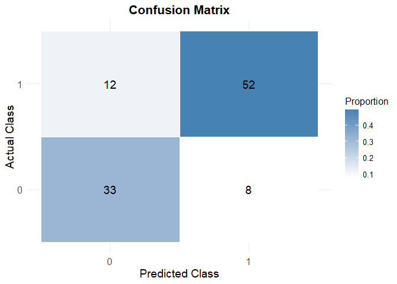

Modelling
================
Yixin Zheng (yz4993), Thomas Tang (tt3022), Yonghao YU (yy3564)
2024-11-16

## Yixin Zheng (yz4993), Thomas Tang (tt3022), Yonghao YU (yy3564)

``` r
library(tidyverse)
```

    ## ── Attaching core tidyverse packages ──────────────────────── tidyverse 2.0.0 ──
    ## ✔ dplyr     1.1.4     ✔ readr     2.1.5
    ## ✔ forcats   1.0.0     ✔ stringr   1.5.1
    ## ✔ ggplot2   3.5.1     ✔ tibble    3.2.1
    ## ✔ lubridate 1.9.3     ✔ tidyr     1.3.1
    ## ✔ purrr     1.0.2     
    ## ── Conflicts ────────────────────────────────────────── tidyverse_conflicts() ──
    ## ✖ dplyr::filter() masks stats::filter()
    ## ✖ dplyr::lag()    masks stats::lag()
    ## ℹ Use the conflicted package (<http://conflicted.r-lib.org/>) to force all conflicts to become errors

``` r
library(janitor)
```

    ## 
    ## 载入程序包：'janitor'
    ## 
    ## The following objects are masked from 'package:stats':
    ## 
    ##     chisq.test, fisher.test

Interpreting num (author: Yixin Zheng): The values for `num` represent
the degree of narrowing in the coronary arteries: 0: No disease (\< 50%
diameter narrowing). 1-4: Increasing severity of disease (\> 50%
diameter narrowing, with different severities).

For convenience, this variable will binarized: 0: No heart disease
(value 0 in num). 1: Presence of heart disease (values 1-4 in num).

\*but if we want to analyze the severity of heart disease num will be
treated as a categorical variable. example code: cleaned_data \<- data
\|\> mutate(num = factor(num, levels = c(0, 1, 2, 3, 4), labels = c(“No
Disease”, “Mild”, “Moderate”, “Severe”, “Very Severe”)))

``` r
cleveland <- read_csv("./data/cleveland.csv", na = "?") |> 
  clean_names() |> 
  mutate(num = if_else(num == 0, 0, 1)) # Binarize the `num` variable: 0 = no heart disease, 1 = heart disease
```

    ## Rows: 303 Columns: 14
    ## ── Column specification ────────────────────────────────────────────────────────
    ## Delimiter: ","
    ## dbl (14): age, sex, cp, trestbps, chol, fbs, restecg, thalach, exang, oldpea...
    ## 
    ## ℹ Use `spec()` to retrieve the full column specification for this data.
    ## ℹ Specify the column types or set `show_col_types = FALSE` to quiet this message.

``` r
# |> drop_na() Removes rows with any missing values (optional, adjust as needed)

hungary = read_csv("./data/hungarian.csv", na = "?") |> 
  clean_names() |> 
  mutate(num = if_else(num == 0, 0, 1))
```

    ## Rows: 294 Columns: 14
    ## ── Column specification ────────────────────────────────────────────────────────
    ## Delimiter: ","
    ## dbl (14): age, sex, cp, trestbps, chol, fbs, restecg, thalach, exang, oldpea...
    ## 
    ## ℹ Use `spec()` to retrieve the full column specification for this data.
    ## ℹ Specify the column types or set `show_col_types = FALSE` to quiet this message.

``` r
# |> drop_na() Removes rows with any missing values (optional, adjust as needed)

long_beach = read_csv("./data/long_beach_va.csv", na = "?") |> 
  clean_names() |> 
  mutate(num = if_else(num == 0, 0, 1))
```

    ## Rows: 200 Columns: 14
    ## ── Column specification ────────────────────────────────────────────────────────
    ## Delimiter: ","
    ## dbl (14): age, sex, cp, trestbps, chol, fbs, restecg, thalach, exang, oldpea...
    ## 
    ## ℹ Use `spec()` to retrieve the full column specification for this data.
    ## ℹ Specify the column types or set `show_col_types = FALSE` to quiet this message.

``` r
# |> drop_na() Removes rows with any missing values (optional, adjust as needed)

switzerland = read_csv("./data/switzerland.csv", na = "?") |> 
  clean_names() |> 
  mutate(num = if_else(num == 0, 0, 1))
```

    ## Rows: 123 Columns: 14
    ## ── Column specification ────────────────────────────────────────────────────────
    ## Delimiter: ","
    ## dbl (14): age, sex, cp, trestbps, chol, fbs, restecg, thalach, exang, oldpea...
    ## 
    ## ℹ Use `spec()` to retrieve the full column specification for this data.
    ## ℹ Specify the column types or set `show_col_types = FALSE` to quiet this message.

``` r
# |> drop_na() Removes rows with any missing values (optional, adjust as needed) 
```

``` r
cor(cleveland$chol, cleveland$num, use = "complete.obs")
```

    ## [1] 0.08516361

# Variable Selection (author: Yonghao YU)

author: Yonghao YU

### Data Preprocessing

``` r
cleveland$region = "Cleveland"
hungary$region = "Hungarian"
long_beach$region = "Long_Beach_VA"
switzerland$region = "Switzerland"
combined_data_one = bind_rows(cleveland, hungary, long_beach, switzerland)

colnames(combined_data_one) = c("age", "sex", "cp", "trestbps", "chol", "fbs",
                             "restecg", "thalach", "exang", "oldpeak", "slope",
                             "ca", "thal", "num", "region")
combined_data_two = combined_data_one |>
  mutate(region = case_when(
    region == "Cleveland" ~ 1,
    region == "Hungarian" ~ 2,
    region == "Long_Beach_VA" ~ 3,
    region == "Switzerland" ~ 4,
  )) |>
  select(-thal,-ca) |>
  drop_na()
case_data = combined_data_two |>
  filter(num == 1)
control_data = combined_data_two |>
  filter(num == 0)
print(case_data)
```

    ## # A tibble: 324 × 13
    ##      age   sex    cp trestbps  chol   fbs restecg thalach exang oldpeak slope
    ##    <dbl> <dbl> <dbl>    <dbl> <dbl> <dbl>   <dbl>   <dbl> <dbl>   <dbl> <dbl>
    ##  1    67     1     4      160   286     0       2     108     1     1.5     2
    ##  2    67     1     4      120   229     0       2     129     1     2.6     2
    ##  3    62     0     4      140   268     0       2     160     0     3.6     3
    ##  4    63     1     4      130   254     0       2     147     0     1.4     2
    ##  5    53     1     4      140   203     1       2     155     1     3.1     3
    ##  6    56     1     3      130   256     1       2     142     1     0.6     2
    ##  7    48     1     2      110   229     0       0     168     0     1       3
    ##  8    58     1     2      120   284     0       2     160     0     1.8     2
    ##  9    58     1     3      132   224     0       2     173     0     3.2     1
    ## 10    60     1     4      130   206     0       2     132     1     2.4     2
    ## # ℹ 314 more rows
    ## # ℹ 2 more variables: num <dbl>, region <dbl>

``` r
print(control_data)
```

    ## # A tibble: 207 × 13
    ##      age   sex    cp trestbps  chol   fbs restecg thalach exang oldpeak slope
    ##    <dbl> <dbl> <dbl>    <dbl> <dbl> <dbl>   <dbl>   <dbl> <dbl>   <dbl> <dbl>
    ##  1    63     1     1      145   233     1       2     150     0     2.3     3
    ##  2    37     1     3      130   250     0       0     187     0     3.5     3
    ##  3    41     0     2      130   204     0       2     172     0     1.4     1
    ##  4    56     1     2      120   236     0       0     178     0     0.8     1
    ##  5    57     0     4      120   354     0       0     163     1     0.6     1
    ##  6    57     1     4      140   192     0       0     148     0     0.4     2
    ##  7    56     0     2      140   294     0       2     153     0     1.3     2
    ##  8    44     1     2      120   263     0       0     173     0     0       1
    ##  9    52     1     3      172   199     1       0     162     0     0.5     1
    ## 10    57     1     3      150   168     0       0     174     0     1.6     1
    ## # ℹ 197 more rows
    ## # ℹ 2 more variables: num <dbl>, region <dbl>

``` r
print(combined_data_two)
```

    ## # A tibble: 531 × 13
    ##      age   sex    cp trestbps  chol   fbs restecg thalach exang oldpeak slope
    ##    <dbl> <dbl> <dbl>    <dbl> <dbl> <dbl>   <dbl>   <dbl> <dbl>   <dbl> <dbl>
    ##  1    63     1     1      145   233     1       2     150     0     2.3     3
    ##  2    67     1     4      160   286     0       2     108     1     1.5     2
    ##  3    67     1     4      120   229     0       2     129     1     2.6     2
    ##  4    37     1     3      130   250     0       0     187     0     3.5     3
    ##  5    41     0     2      130   204     0       2     172     0     1.4     1
    ##  6    56     1     2      120   236     0       0     178     0     0.8     1
    ##  7    62     0     4      140   268     0       2     160     0     3.6     3
    ##  8    57     0     4      120   354     0       0     163     1     0.6     1
    ##  9    63     1     4      130   254     0       2     147     0     1.4     2
    ## 10    53     1     4      140   203     1       2     155     1     3.1     3
    ## # ℹ 521 more rows
    ## # ℹ 2 more variables: num <dbl>, region <dbl>

author: Yonghao YU

### For Continues case

For continuous variables, we use mean and standard deviation (std) to
describe the distribution in overall samples, samples of control(num =
0), and samples of case(num = 1). Then, we use t-test to examine whether
the means of these variables are significantly different between case
group and control group (significance level = 0.05).

``` r
# 1. Mean and Std for Continuous Variables (Overall)
list_conti_all = list(
  age = combined_data_two$age,
  trestbps = combined_data_two$trestbps,
  chol = combined_data_two$chol,
  thalach = combined_data_two$thalach,
  oldpeak = combined_data_two$oldpeak
) |> 
  lapply(na.omit) 

mean_all = sapply(list_conti_all, mean) |> 
  as.data.frame()|>
  setNames("Overall Mean")

std_all = sapply(list_conti_all, sd) |> 
  as.data.frame() |>
  setNames("Overall Std")

# 2. p-value of t-test for Continuous Variables
t_test = function(variable) {
  t_test_result = t.test(combined_data_two[[variable]] ~ combined_data_two$num)
  return(data.frame(
    variable = variable,
    p_value = t_test_result$p.value
  ))
}

p_value = 
  lapply(c("age", "trestbps", "chol", "thalach", "oldpeak"), t_test) |> 
  bind_rows() |> 
  as.data.frame()

# 3. Mean and Std for Control Group
list_conti_control = list(
  age = control_data$age,
  trestbps = control_data$trestbps,
  chol = control_data$chol,
  thalach = control_data$thalach,
  oldpeak = control_data$oldpeak
) |> 
  lapply(na.omit)

mean_control = sapply(list_conti_control, mean) |> 
  as.data.frame() |>
  setNames("Control Mean")

std_control = sapply(list_conti_control, sd) |> 
  as.data.frame() |>
  setNames("Control Std")

# 4. Mean and Std for Case Group
list_conti_case = list(
  age = case_data$age,
  trestbps = case_data$trestbps,
  chol = case_data$chol,
  thalach = case_data$thalach,
  oldpeak = case_data$oldpeak
) |> 
  lapply(na.omit)

mean_case = sapply(list_conti_case, mean) |> 
  as.data.frame() |>
  setNames("Case Mean")

std_case = sapply(list_conti_case, sd) |> 
  as.data.frame() |>
  setNames("Case Std")

conti_des_df =
  as.data.frame(cbind(mean_all, std_all, mean_control, std_control, mean_case, std_case, p_value))
conti_des_df = conti_des_df[, -grep("variable", colnames(conti_des_df))] |> 
  knitr::kable(digits = 6)
conti_des_df
```

|  | Overall Mean | Overall Std | Control Mean | Control Std | Case Mean | Case Std | p_value |
|:---|---:|---:|---:|---:|---:|---:|---:|
| age | 54.843691 | 8.824069 | 52.908213 | 9.248788 | 56.080247 | 8.323177 | 0.000074 |
| trestbps | 133.406780 | 18.969496 | 129.734300 | 16.322060 | 135.753086 | 20.158831 | 0.000179 |
| chol | 216.854991 | 99.014215 | 237.043478 | 68.313903 | 203.956790 | 112.615863 | 0.000030 |
| thalach | 138.463277 | 25.833649 | 152.758454 | 22.958375 | 129.330247 | 23.329890 | 0.000000 |
| oldpeak | 1.218456 | 1.105150 | 0.726087 | 0.805741 | 1.533025 | 1.155598 | 0.000000 |

Based on the result, we can find that all five features are
significantly different between case and control.

author: Yonghao YU

### For Discrete case

For binary and categorical variables, we use count (n) and percentage
(pct) to describe the distribution in overall samples, samples of
control(num = 0), and samples of case(num = 1). Then, as the data meet
the assumption, we use chi-sq test to examine whether the distribution
of these variables are significantly different between case group and
control group (significance level = 0.05).

``` r
list_cat_all = as.data.frame(list(
  sex = combined_data_two$sex,
  cp = combined_data_two$cp,
  fbs = combined_data_two$fbs,
  restecg = combined_data_two$restecg,
  exang = combined_data_two$exang,
  slope = combined_data_two$slope,
  region = combined_data_two$region
))

# 1. Overall Counts and Chi-Square Test
cat_vars = names(list_cat_all)

count_all_function = function(variable) {
  table_value = table(list_cat_all[[variable]], combined_data_two$num) 
  chi_sq_test = chisq.test(table_value)
  
  count = table(list_cat_all[[variable]])
  total = sum(count)
  pct = count / total
  
  result_df = tibble(
    variable = rep(variable, length(count)),
    category = names(count),
    n = as.numeric(count),
    pct = round(pct, 3),
    p_value = round(chi_sq_test$p.value, 3)
  )
  
  return(result_df)
}

cat_count_chisq = lapply(cat_vars, count_all_function) |> 
  bind_rows()

# 2. Control Group Counts and Percentages
list_cat_ctrl = as.data.frame(list(
  sex = control_data$sex,
  cp = control_data$cp,
  fbs = control_data$fbs,
  restecg = control_data$restecg,
  exang = control_data$exang,
  slope = control_data$slope,
  region = control_data$region
))

cat_vars_ctrl = names(list_cat_ctrl)

count_ctrl_function = function(variable) {
  count = table(list_cat_ctrl[[variable]])
  total = sum(count)
  pct = count / total
  
  result_df = tibble(
    variable = rep(variable, length(count)),
    category = names(count),
    control_n = as.numeric(count),
    control_pct = round(pct, 3)
  )
  
  return(result_df)
}

cat_count_ctrl = lapply(cat_vars_ctrl, count_ctrl_function) |> 
  bind_rows()

# 3. Case Group Counts and Percentages
list_cat_case = as.data.frame(list(
  sex = case_data$sex,
  cp = case_data$cp,
  fbs = case_data$fbs,
  restecg = case_data$restecg,
  exang = case_data$exang,
  slope = case_data$slope,
  region = case_data$region
))

cat_vars_case = names(list_cat_case)

count_case_function = function(variable) {
  count = table(list_cat_case[[variable]])
  total = sum(count)
  pct = count / total
  
  result_df = tibble(
    variable = rep(variable, length(count)),
    category = names(count),
    case_n = as.numeric(count),
    case_pct = round(pct, 3)
  )
  return(result_df)
}

cat_count_case = lapply(cat_vars_case, count_case_function) |> 
  bind_rows()

# 4. Combine Results
final_cat_count = cat_count_chisq |>
  left_join(cat_count_ctrl, by = c("variable", "category")) |>
  left_join(cat_count_case, by = c("variable", "category"))|>
  knitr::kable(digits = 3)

print(final_cat_count)
```

    ## 
    ## 
    ## |variable |category |   n|   pct| p_value| control_n| control_pct| case_n| case_pct|
    ## |:--------|:--------|---:|-----:|-------:|---------:|-----------:|------:|--------:|
    ## |sex      |0        | 127| 0.239|   0.000|        87|       0.420|     40|    0.123|
    ## |sex      |1        | 404| 0.761|   0.000|       120|       0.580|    284|    0.877|
    ## |cp       |1        |  30| 0.056|   0.000|        18|       0.087|     12|    0.037|
    ## |cp       |2        |  70| 0.132|   0.000|        51|       0.246|     19|    0.059|
    ## |cp       |3        | 114| 0.215|   0.000|        80|       0.386|     34|    0.105|
    ## |cp       |4        | 317| 0.597|   0.000|        58|       0.280|    259|    0.799|
    ## |fbs      |0        | 446| 0.840|   0.378|       178|       0.860|    268|    0.827|
    ## |fbs      |1        |  85| 0.160|   0.378|        29|       0.140|     56|    0.173|
    ## |restecg  |0        | 297| 0.559|   0.000|       123|       0.594|    174|    0.537|
    ## |restecg  |1        |  73| 0.137|   0.000|        13|       0.063|     60|    0.185|
    ## |restecg  |2        | 161| 0.303|   0.000|        71|       0.343|     90|    0.278|
    ## |exang    |0        | 267| 0.503|   0.000|       163|       0.787|    104|    0.321|
    ## |exang    |1        | 264| 0.497|   0.000|        44|       0.213|    220|    0.679|
    ## |slope    |1        | 173| 0.326|   0.000|       119|       0.575|     54|    0.167|
    ## |slope    |2        | 310| 0.584|   0.000|        76|       0.367|    234|    0.722|
    ## |slope    |3        |  48| 0.090|   0.000|        12|       0.058|     36|    0.111|
    ## |region   |1        | 303| 0.571|   0.000|       164|       0.792|    139|    0.429|
    ## |region   |2        |  95| 0.179|   0.000|        27|       0.130|     68|    0.210|
    ## |region   |3        |  87| 0.164|   0.000|        15|       0.072|     72|    0.222|
    ## |region   |4        |  46| 0.087|   0.000|         1|       0.005|     45|    0.139|

Based on the result, we can find that except fbs, the rest of all other
binary and categorical features are significantly different between case
and control.

hypothesis (author: Yixin Zheng) \* need to run some test choose
explanatory variables?

1.  Comparing Diagnostic Factors for Heart Disease Across Regions
    explore whether certain diagnostic factors (e.g., cholesterol
    levels, exercise-induced angina) are more predictive of heart
    disease in one region compared to others.

- there are many null values in the `chol` column in switzerland
  dataset. So maybe we need to use other diagnostic factors such as
  `trestbps` if we want to compare the regions Example Hypothesis (SLR):
- **Null Hypothesis (H_0):** There is no linear relationship between
  cholesterol levels (`chol`) and the presence of heart disease (`num`).
- **Alternative Hypothesis (H_a):** There is a positive linear
  relationship between cholesterol levels (`chol`) and the presence of
  heart disease (`num`). ($\beta_1>0$) Where:
  - `num` is the target variable indicating heart disease presence.
  - `chol` is the predictor variable representing cholesterol levels.

$$ num = \beta_0 + \beta_1 \cdot \text{chol} + \epsilon $$

Example Hypothesis (MLR): - **Null Hypothesis (H_0):** Cholesterol
levels (`chol`), blood pressure (`trestbps`), and exercise-induced
angina (`exang`) are not significant predictors of heart disease
presence (`num`). - **Alternative Hypothesis (H_a):** At least one of
these variables (`chol`, `trestbps`, `exang`) is a significant predictor
of heart disease presence (`num`).

$$ num = \beta_0 + \beta_1 \cdot \text{chol} + \beta_2 \cdot \text{trestbps} + \beta_3 \cdot \text{exang} + \epsilon $$

2.  Examining Predictive Power of Clinical Indicators for Heart Disease
    in Diverse Populations

Example Hypothesis (SLR): - **Null Hypothesis (H_0):** There is no
linear relationship between maximum heart rate achieved (`thalach`) and
the presence of heart disease (`num`). - **Alternative Hypothesis
(H_a):** There is a negative linear relationship between maximum heart
rate achieved (`thalach`) and the presence of heart disease (`num`).
($\beta_1<0$)

$$ num = \beta_0 + \beta_1 \cdot \text{thalach} + \epsilon $$ Example
Hypothesis (MLR): - **Null Hypothesis (H_0):** Maximum heart rate
(`thalach`), fasting blood sugar (`fbs`), and the slope of the ST
segment (`slope`) are not significant predictors of heart disease
presence (`num`). - **Alternative Hypothesis (H_a):** At least one of
these variables (`thalach`, `fbs`, `slope`) is a significant predictor
of heart disease presence (`num`).

$$ num = \beta_0 + \beta_1 \cdot \text{thalach} + \beta_2 \cdot \text{fbs} + \beta_3 \cdot \text{slope} + \epsilon $$

3.  Influence of Age and Lifestyle Factors on Heart Disease

Example Hypothesis (SLR): - **Null Hypothesis (H_0):** There is no
linear relationship between age (`age`) and the presence of heart
disease (`num`). - **Alternative Hypothesis (H_a):** There is a positive
linear relationship between age (`age`) and the presence of heart
disease (`num`). ($\beta_1>0$)

$$ num = \beta_0 + \beta_1 \cdot \text{age} + \epsilon $$ Example
Hypothesis (MLR): - **Null Hypothesis (H_0):** Age (`age`), chest pain
type (`cp`), and exercise-induced angina (`exang`) are not significant
predictors of heart disease presence (`num`). - **Alternative Hypothesis
(H_a):** At least one of these variables (`age`, `cp`, `exang`) is a
significant predictor of heart disease presence (`num`).

$$ num = \beta_0 + \beta_1 \cdot \text{age} + \beta_2 \cdot \text{cp} + \beta_3 \cdot \text{exang} + \epsilon $$

4.  Regional Patterns in Heart Disease Diagnostic Attributes

Example Hypothesis (SLR): - **Null Hypothesis (H_0):** There is no
linear relationship between diagnostic attributes (e.g., cholesterol,
age) and heart disease (`num`) in each region. - **Alternative
Hypothesis (H_a):**The relationship between diagnostic attributes (e.g.,
cholesterol, age) and heart disease (`num`) differs significantly across
regions. - This hypothesis can be tested by performing SLR for each
region and comparing the coefficients (beta_1 values) to see if they
vary.

Example Hypothesis (MLR): - **Null Hypothesis (H_0):** Regional
differences do not significantly influence the predictive power of
diagnostic factors for heart disease. - **Alternative Hypothesis
(H_a):** Regional differences significantly influence the predictive
power of diagnostic factors for heart disease.

$$ num = \beta_0 + \beta_1 \cdot \text{chol} + \beta_2 \cdot \text{age} + \beta_3 \cdot \text{region} + \beta_4 \cdot (\text{chol} \times \text{region}) + \beta_5 \cdot (\text{age} \times \text{region}) + \epsilon $$

author: Thomas Tang

``` r
cleveland <- read.csv("./data/cleveland.csv", header = FALSE)
hungarian <- read.csv("./data/hungarian.csv", header = FALSE)
long_beach <- read.csv("./data/long_beach_va.csv", header = FALSE)
switzerland <- read.csv("./data/switzerland.csv", header = FALSE)

# Add region column and combine datasets
cleveland$region <- "Cleveland"
hungarian$region <- "Hungarian"
long_beach$region <- "Long_Beach_VA"
switzerland$region <- "Switzerland"
combined_data <- bind_rows(cleveland, hungarian, long_beach, switzerland)

colnames(combined_data) <- c("age", "sex", "cp", "trestbps", "chol", "fbs",
                             "restecg", "thalach", "exang", "oldpeak", "slope",
                             "ca", "thal", "num", "region")
combined_data <- combined_data %>%
  mutate(across(c(age, sex, cp, trestbps, chol, fbs, restecg, thalach,
                  exang, oldpeak, slope, ca, thal, num), as.numeric))
```

    ## Warning: There were 14 warnings in `mutate()`.
    ## The first warning was:
    ## ℹ In argument: `across(...)`.
    ## Caused by warning:
    ## ! 强制改变过程中产生了NA
    ## ℹ Run `dplyr::last_dplyr_warnings()` to see the 13 remaining warnings.

Dropped variables with excessive missing values (ca and thal). Removed
rows with missing values in critical variables. Converted num to binary
(0 = no heart disease, 1 = heart disease) and set as a factor.

``` r
cleaned_data <- combined_data %>% select(-ca, -thal)
critical_columns <- c("num", "age", "sex", "cp", "trestbps", "chol",
                      "fbs", "restecg", "thalach", "exang", "oldpeak", 
                      "slope","region")
cleaned_data <- cleaned_data %>% drop_na(all_of(critical_columns))
cleaned_data$num <- ifelse(cleaned_data$num > 0, 1, 0)
cleaned_data$num <- as.factor(cleaned_data$num)
logistic_model <- glm(num ~ age + sex + cp + trestbps + chol + fbs +
                      restecg + thalach + exang + oldpeak + region,
                      data = cleaned_data, family = binomial)
summary(logistic_model)
```

    ## 
    ## Call:
    ## glm(formula = num ~ age + sex + cp + trestbps + chol + fbs + 
    ##     restecg + thalach + exang + oldpeak + region, family = binomial, 
    ##     data = cleaned_data)
    ## 
    ## Coefficients:
    ##                      Estimate Std. Error z value Pr(>|z|)    
    ## (Intercept)         -4.529743   1.806627  -2.507 0.012166 *  
    ## age                  0.016202   0.016132   1.004 0.315231    
    ## sex                  1.469384   0.292048   5.031 4.87e-07 ***
    ## cp                   0.668141   0.138938   4.809 1.52e-06 ***
    ## trestbps             0.009865   0.007107   1.388 0.165114    
    ## chol                 0.001104   0.001820   0.607 0.544104    
    ## fbs                  0.089712   0.341956   0.262 0.793052    
    ## restecg              0.166720   0.141642   1.177 0.239175    
    ## thalach             -0.016074   0.006369  -2.524 0.011615 *  
    ## exang                0.899701   0.279483   3.219 0.001286 ** 
    ## oldpeak              0.696194   0.136346   5.106 3.29e-07 ***
    ## regionHungarian      0.179038   0.387015   0.463 0.643642    
    ## regionLong_Beach_VA  0.120733   0.435716   0.277 0.781709    
    ## regionSwitzerland    3.843320   1.162368   3.306 0.000945 ***
    ## ---
    ## Signif. codes:  0 '***' 0.001 '**' 0.01 '*' 0.05 '.' 0.1 ' ' 1
    ## 
    ## (Dispersion parameter for binomial family taken to be 1)
    ## 
    ##     Null deviance: 710.13  on 530  degrees of freedom
    ## Residual deviance: 427.45  on 517  degrees of freedom
    ## AIC: 455.45
    ## 
    ## Number of Fisher Scoring iterations: 6

(author= Thomas Tang) Significant Predictors (p-value \< 0.05): sex
(1.409350): *Being male increases the log-odds of heart disease
significantly. *Odds Ratio: exp(1.469)=4.34 → Males are 4.34 times more
likely to have heart disease than females.

cp (chest pain): *Higher chest pain levels increase the log-odds of
heart disease. *Odds Ratio: exp(0.668)=1.95 → A strong predictor for
heart disease.

thalach (max heart rate achieved): *Higher heart rates decrease the
log-odds of heart disease. *Odds Ratio: exp(−0.014)=0.986, suggesting a
protective effect. exang (exercise-induced angina): *Presence of
exercise-induced angina increases the odds of heart disease. *Odds
Ratio: exp(0.899)=2.46. oldpeak (ST depression): *Higher ST depression
values significantly increase the odds of heart disease. *Odds Ratio:
exp(0.669)=1.95. regionSwitzerland: *Patients from Switzerland have
significantly higher odds of heart disease compared to the reference
region (Cleveland). *Odds Ratio: exp(3.843)=46.64, suggesting a strong
regional effect.

Non-Significant Predictors (p-value \> 0.05): age, trestbps (resting
blood pressure), chol (cholesterol), fbs (fasting blood sugar), restecg
(resting ECG results), regionHungarian, regionLong_Beach_VA.

Regional Effects: \*Patients from Switzerland have much higher odds of
heart disease compared to Cleveland, Hungarian and Long Beach VA.

separated by region:

``` r
cleveland_data <- cleaned_data %>% filter(region == "Cleveland")
hungarian_data <- cleaned_data %>% filter(region == "Hungarian")
long_beach_data <- cleaned_data %>% filter(region == "Long_Beach_VA")
switzerland_data <- cleaned_data %>% filter(region == "Switzerland")

cleveland_model <- glm(num ~ age + sex + cp + trestbps + chol + fbs +
                       restecg + thalach + exang + oldpeak,
                       data = cleveland_data, family = binomial)
hungarian_model <- glm(num ~ age + sex + cp + trestbps + chol + fbs +
                       restecg + thalach + exang + oldpeak,
                       data = hungarian_data, family = binomial)
long_beach_model <- glm(num ~ age + sex + cp + trestbps + chol + fbs +
                        restecg + thalach + exang + oldpeak,
                        data = long_beach_data, family = binomial)
switzerland_model <- glm(num ~ age + sex + cp + trestbps + chol + fbs +
                         restecg + thalach + exang + oldpeak,
                         data = switzerland_data, family = binomial)
```

    ## Warning: glm.fit:算法没有聚合

    ## Warning: glm.fit:拟合概率算出来是数值零或一

``` r
extract_results <- function(model, region) {
  coefficients <- summary(model)$coefficients
  data.frame(
    Region = region,
    Variable = rownames(coefficients),
    Estimate = coefficients[, "Estimate"],
    Std_Error = coefficients[, "Std. Error"],
    P_Value = coefficients[, "Pr(>|z|)"]
  )
}

# Extract results for each region
cleveland_results <- extract_results(cleveland_model, "Cleveland")
hungarian_results <- extract_results(hungarian_model, "Hungarian")
long_beach_results <- extract_results(long_beach_model, "Long_Beach_VA")
switzerland_results <- extract_results(switzerland_model, "Switzerland")
regional_results <- bind_rows(cleveland_results, hungarian_results,
                               long_beach_results, switzerland_results)

# View the consolidated results
regional_results
```

    ##                         Region    Variable      Estimate    Std_Error
    ## (Intercept)...1      Cleveland (Intercept) -6.409349e+00 2.366230e+00
    ## age...2              Cleveland         age  2.305274e-02 2.078413e-02
    ## sex...3              Cleveland         sex  1.914565e+00 3.963041e-01
    ## cp...4               Cleveland          cp  8.005256e-01 1.784567e-01
    ## trestbps...5         Cleveland    trestbps  1.933797e-02 9.694877e-03
    ## chol...6             Cleveland        chol  5.199003e-03 3.249779e-03
    ## fbs...7              Cleveland         fbs -1.801118e-01 4.422953e-01
    ## restecg...8          Cleveland     restecg  2.186373e-01 1.622814e-01
    ## thalach...9          Cleveland     thalach -2.566683e-02 9.002007e-03
    ## exang...10           Cleveland       exang  1.016419e+00 3.608669e-01
    ## oldpeak...11         Cleveland     oldpeak  5.908489e-01 1.596412e-01
    ## (Intercept)...12     Hungarian (Intercept)  9.770581e-01 5.205882e+00
    ## age...13             Hungarian         age -8.168691e-02 5.314665e-02
    ## sex...14             Hungarian         sex  1.356069e+00 6.866089e-01
    ## cp...15              Hungarian          cp  7.316002e-01 3.775361e-01
    ## trestbps...16        Hungarian    trestbps  3.011956e-02 1.858612e-02
    ## chol...17            Hungarian        chol  8.921158e-04 5.398937e-03
    ## fbs...18             Hungarian         fbs  1.801468e+01 1.879517e+03
    ## restecg...19         Hungarian     restecg -6.322004e-01 7.733075e-01
    ## thalach...20         Hungarian     thalach -3.876461e-02 1.929788e-02
    ## exang...21           Hungarian       exang  1.502774e-01 7.325074e-01
    ## oldpeak...22         Hungarian     oldpeak  9.291678e-01 5.364974e-01
    ## (Intercept)...23 Long_Beach_VA (Intercept) -1.366177e-01 4.132572e+00
    ## age...24         Long_Beach_VA         age  1.796714e-02 4.359182e-02
    ## sex...25         Long_Beach_VA         sex  4.559604e-01 1.494038e+00
    ## cp...26          Long_Beach_VA          cp -2.887811e-02 4.302410e-01
    ## trestbps...27    Long_Beach_VA    trestbps -1.079782e-02 1.676406e-02
    ## chol...28        Long_Beach_VA        chol -7.260783e-04 2.764071e-03
    ## fbs...29         Long_Beach_VA         fbs  1.762377e-01 7.424995e-01
    ## restecg...30     Long_Beach_VA     restecg -3.073046e-01 4.673256e-01
    ## thalach...31     Long_Beach_VA     thalach  1.472768e-03 1.510586e-02
    ## exang...32       Long_Beach_VA       exang  1.774583e+00 8.143903e-01
    ## oldpeak...33     Long_Beach_VA     oldpeak  4.119425e-01 3.761805e-01
    ## (Intercept)...34   Switzerland (Intercept) -4.864726e+02 3.401466e+05
    ## age...35           Switzerland         age -1.761182e+01 6.992787e+03
    ## sex...36           Switzerland         sex  1.400754e+02 1.953051e+05
    ## cp...37            Switzerland          cp  2.696132e+00 1.203799e+04
    ## trestbps...38      Switzerland    trestbps  6.806273e+00 2.736445e+03
    ## fbs...39           Switzerland         fbs -8.133709e+01 1.467447e+05
    ## restecg...40       Switzerland     restecg  9.072661e+01 1.413873e+05
    ## thalach...41       Switzerland     thalach  5.029885e+00 1.969977e+03
    ## exang...42         Switzerland       exang  2.544557e+02 1.604791e+05
    ## oldpeak...43       Switzerland     oldpeak -1.201417e+02 8.414472e+04
    ##                       P_Value
    ## (Intercept)...1  6.755232e-03
    ## age...2          2.673649e-01
    ## sex...3          1.358144e-06
    ## cp...4           7.263202e-06
    ## trestbps...5     4.608011e-02
    ## chol...6         1.096425e-01
    ## fbs...7          6.838460e-01
    ## restecg...8      1.778924e-01
    ## thalach...9      4.354982e-03
    ## exang...10       4.853456e-03
    ## oldpeak...11     2.146612e-04
    ## (Intercept)...12 8.511248e-01
    ## age...13         1.242909e-01
    ## sex...14         4.826551e-02
    ## cp...15          5.264416e-02
    ## trestbps...16    1.051161e-01
    ## chol...17        8.687557e-01
    ## fbs...18         9.923526e-01
    ## restecg...19     4.136269e-01
    ## thalach...20     4.456365e-02
    ## exang...21       8.374512e-01
    ## oldpeak...22     8.328873e-02
    ## (Intercept)...23 9.736277e-01
    ## age...24         6.802165e-01
    ## sex...25         7.602240e-01
    ## cp...26          9.464856e-01
    ## trestbps...27    5.195072e-01
    ## chol...28        7.927939e-01
    ## fbs...29         8.123796e-01
    ## restecg...30     5.108072e-01
    ## thalach...31     9.223321e-01
    ## exang...32       2.932927e-02
    ## oldpeak...33     2.734877e-01
    ## (Intercept)...34 9.988589e-01
    ## age...35         9.979905e-01
    ## sex...36         9.994277e-01
    ## cp...37          9.998213e-01
    ## trestbps...38    9.980154e-01
    ## fbs...39         9.995578e-01
    ## restecg...40     9.994880e-01
    ## thalach...41     9.979628e-01
    ## exang...42       9.987349e-01
    ## oldpeak...43     9.988608e-01

``` r
male_data <- cleaned_data %>% filter(sex == 1)
female_data <- cleaned_data %>% filter(sex == 0)

male_model <- glm(num ~ age + cp + trestbps + chol + fbs +
                  restecg + thalach + exang + oldpeak,
                  data = male_data, family = binomial)
female_model <- glm(num ~ age + cp + trestbps + chol + fbs +
                    restecg + thalach + exang + oldpeak,
                    data = female_data, family = binomial)
# Function to extract model results
extract_results <- function(model, gender) {
  coefficients <- summary(model)$coefficients
  data.frame(
    Gender = gender,
    Variable = rownames(coefficients),
    Estimate = coefficients[, "Estimate"],
    Std_Error = coefficients[, "Std. Error"],
    P_Value = coefficients[, "Pr(>|z|)"]
  )
}

# Extract results for males and females
male_results <- extract_results(male_model, "Male")
female_results <- extract_results(female_model, "Female")
gender_results <- bind_rows(male_results, female_results)
```

Males Significant Predictors (p-value \< 0.05):

Chest Pain (cp) (β=0.624, p\<0.001): Higher chest pain levels increase
the odds of heart disease. Odds Ratio= exp(0.624)=1.87. Max Heart Rate
(thalach) (β=−0.026, p\<0.001): Higher maximum heart rates reduce the
odds of heart disease. Odds Ratio= exp(−0.026)=0.974 (protective
effect). Exercise-Induced Angina (exang) (β=0.717, p=0.025): Presence of
exercise-induced angina significantly increases the odds of heart
disease. Odds Ratio=exp(0.717)=2.05. ST Depression (oldpeak) (β=0.569,
p\<0.001): Higher ST depression significantly increases the odds of
heart disease. Odds Ratio = exp(0.569)=1.77.

Non-Significant Predictors: age, trestbps, chol, fbs, restecg.

Females Significant Predictors (p-value \< 0.05):

Chest Pain (cp) (β=0.927, p=0.006): Stronger effect than males. Odds
Ratio = exp(0.927)=2.53. Exercise-Induced Angina (exang) (β=1.144,
p=0.037): Stronger effect than males. Odds Ratio = exp(1.144)=3.14. ST
Depression (oldpeak) (β=0.677,p=0.020): Similar effect to males. Odds
Ratio = exp(0.677)=1.97. Non-Significant Predictors: age, trestbps,
chol, fbs, restecg, thalach.

Conclusions Predictors for Both Genders: cp, exang, and oldpeak are
significant predictors for both males and females.

Gender-Specific Differences: Stronger effects of cp and exang in females
suggest potential gender-specific diagnostic markers for heart disease.

(author: Yonghao YU)

## Try Random Forest Classifier!

### A brief intro to Random Forest Algorithm

Random Forest is an ensemble learning algorithm used for classification
and regression tasks. It builds multiple decision trees using bootstrap
sampling (random subsets of data) and selects features randomly at each
split to increase diversity. Each tree predicts independently, and the
final output is determined by majority voting (classification) or
averaging (regression). Random Forest is robust to overfitting, handles
high-dimensional data well, and provides feature importance scores.

### First, construct the model and generate the results!

author: Yonghao YU

``` r
library(caret)
```

    ## Warning: 程序包'caret'是用R版本4.4.2 来建造的

    ## 载入需要的程序包：lattice

    ## 
    ## 载入程序包：'caret'

    ## The following object is masked from 'package:purrr':
    ## 
    ##     lift

``` r
library(randomForest)
```

    ## Warning: 程序包'randomForest'是用R版本4.4.2 来建造的

    ## randomForest 4.7-1.2

    ## Type rfNews() to see new features/changes/bug fixes.

    ## 
    ## 载入程序包：'randomForest'

    ## The following object is masked from 'package:dplyr':
    ## 
    ##     combine

    ## The following object is masked from 'package:ggplot2':
    ## 
    ##     margin

``` r
# drop out the variable "ca" and "thal" which are have so many missing values inside
variables = c("chol", "cp", "age", "thalach", "oldpeak", "num", "restecg", "fbs", "region", "slope", "trestbps", "exang")
data = combined_data_two[, variables]
data$num = as.factor(data$num)

# check and deal with missing data
if (any(is.na(data))) {
  print("Missing value detected")
  data = na.omit(data)
  print("Missing data have been deleted")
}
# split the dataset into training and testing datasets
set.seed(42)
trainIndex = createDataPartition(data$num, p = 0.8, list = FALSE)
trainData = data[trainIndex, ]
testData = data[-trainIndex, ]

# Construct the random forest model and evaluate the model results
rf_model = randomForest(num ~ ., data = trainData, importance = TRUE)
rf_pred = predict(rf_model, testData)
rf_conf_matrix = confusionMatrix(rf_pred, testData$num)
print("The model result is")
```

    ## [1] "The model result is"

``` r
print(rf_conf_matrix)
```

    ## Confusion Matrix and Statistics
    ## 
    ##           Reference
    ## Prediction  0  1
    ##          0 31 14
    ##          1 10 50
    ##                                           
    ##                Accuracy : 0.7714          
    ##                  95% CI : (0.6793, 0.8477)
    ##     No Information Rate : 0.6095          
    ##     P-Value [Acc > NIR] : 0.000325        
    ##                                           
    ##                   Kappa : 0.5281          
    ##                                           
    ##  Mcnemar's Test P-Value : 0.540291        
    ##                                           
    ##             Sensitivity : 0.7561          
    ##             Specificity : 0.7812          
    ##          Pos Pred Value : 0.6889          
    ##          Neg Pred Value : 0.8333          
    ##              Prevalence : 0.3905          
    ##          Detection Rate : 0.2952          
    ##    Detection Prevalence : 0.4286          
    ##       Balanced Accuracy : 0.7687          
    ##                                           
    ##        'Positive' Class : 0               
    ## 

From the model we can observe the following things: 1. The model
correctly classified 77.14% of the instances. 2. The true accuracy is
expected to fall 95% of the time in (0.6793, 0.8477) 3. The information
rate is 0.6095 which is less than the accuracy rate (p-value also
indicate this), indicating the model we built actually capture some
significant features. 4. The Kappa is 0.5281 which is in the range
\[40,60\], which indicate our classifier achieves moderate level of
classification 5. High sensitivity (0.7561) indicates good
identification of positives. 6. High specificity (0.7812) indicates good
identification of negatives. 7. Balanced accuracy (76.87%) suggests the
model balances its performance across both classes well.

author: Yonghao YU \# Then we show the feature importance trends(The
trend is descending according to the MeanDecreaseAccuracy)

``` r
var_imp = importance(rf_model)
var_imp_df = as.data.frame(var_imp)
var_imp_df$Variable = rownames(var_imp_df)
rownames(var_imp_df) = NULL
var_imp_df = var_imp_df[order(var_imp_df$MeanDecreaseAccuracy, decreasing = TRUE), ]
ggplot(var_imp_df, aes(x = reorder(Variable, -MeanDecreaseAccuracy))) +
  geom_line(aes(y = MeanDecreaseAccuracy, group = 1, color = "MeanDecreaseAccuracy")) +
  geom_point(aes(y = MeanDecreaseAccuracy, color = "MeanDecreaseAccuracy")) +
  geom_line(aes(y = MeanDecreaseGini, group = 1, color = "MeanDecreaseGini")) +
  geom_point(aes(y = MeanDecreaseGini, color = "MeanDecreaseGini")) +
  labs(title = "Feature Importance Trends",
       x = "Features",
       y = "Importance",
       color = "Metric") +
  theme_minimal() +
  theme(axis.text.x = element_text(angle = 0, hjust = 1))
```

<!-- -->

Then we ranked the predictors descendingly based on the
MeanDecreaseAccuracy which measures the decrease in overall model
accuracy when the variable is permuted. And we show them in a line plot!
Based on the MeanDecreaseAccuracy and MeanDecreaseGini, we can drop out
restecg, trestbps, and fbs predictors that have relatively small impact
on our prediction. And then we can focus on the first eight predictors
that have more impact on our prediction results!

### Last, simulate the prediction which predicts the num with the new data based on the model we built!

author: Yonghao YU

``` r
# construct a new dataframe which includes new data
new_data = data.frame(
  age = c(63,39),
  sex = c(1, 1),
  cp = c(1, 2),
  trestbps = c(145, 120),
  chol = c(233, 200),
  fbs = c(1, 0),
  restecg = c(2, 0),
  thalach = c(150, 160),
  exang = c(0, 1),
  oldpeak = c(2.3, 1),
  slope = c(3, 2),
  region = c(1, 2)
)
# predict the results based on the model we have trained
predicted_num = predict(rf_model, new_data)
print("The prediction result is：")
```

    ## [1] "The prediction result is："

``` r
print(data.frame(new_data, Predicted_num = predicted_num))
```

    ##   age sex cp trestbps chol fbs restecg thalach exang oldpeak slope region
    ## 1  63   1  1      145  233   1       2     150     0     2.3     3      1
    ## 2  39   1  2      120  200   0       0     160     1     1.0     2      2
    ##   Predicted_num
    ## 1             0
    ## 2             0

From the results, we can see that the model can generate some results
based on the predictor values we put in!
